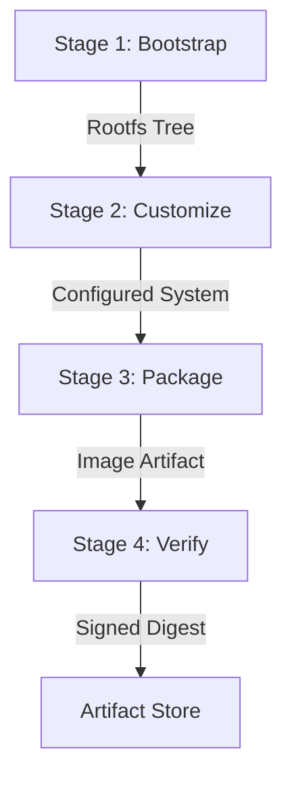

# AIOS Base Linux System: Base Image Build Architecture & Operational Guide

## 1. Executive Overview & Architectural Role
Phase 1 of AIOS develops the core bootable target and base Linux operating system environment. The **Base Image Build** subsystem is responsible for deterministic, cryptographically verifiable, and policy-compliant OS image synthesis.

The subsystem produces image artifacts across three standard target formats:
- **`raw`**: Sparse raw disk image for direct disk flashing or hypervisor deployment.
- **`qcow2`**: Copy-on-write virtual disk image optimized for QEMU/KVM development and CI testing.
- **`iso`**: Hybrid ISO-9660 bootable image supporting UEFI and legacy BIOS systems.

Every synthesized image adheres strictly to reproducible build practices, kernel security parameter lockdown, mandatory package inclusion, and immutable audit logging.

---

## 2. Core Data Model & Types
The base image data model is defined in `code/aiosh-rust/aiosh-core/src/base_image.rs`:

### `BaseImageManifest`
| Field | Type | Description |
|---|---|---|
| `id` | `String` | Unique alphanumeric identifier (e.g. `debian-12-minimal-x86_64`) |
| `distro_id` | `String` | Base distribution reference (e.g. `debian`) |
| `version` | `String` | Base image semantic release version (e.g. `1.0.0`) |
| `architecture` | `String` | Target hardware architecture (`x86_64`, `aarch64`, `riscv64`) |
| `format` | `TargetFormat` | Output artifact container format (`raw`, `qcow2`, `iso`) |
| `kernel` | `KernelConfig` | Kernel release, command line parameters, and module list |
| `packages` | `Vec<String>` | Required packages to install in rootfs |
| `filesystem` | `String` | Root filesystem type (`ext4`, `squashfs`, `btrfs`, `erofs`, `xfs`) |
| `size_budget_bytes` | `u64` | Maximum allowable uncompressed image size in bytes |
| `created_at` | `String` | ISO 8601 UTC creation timestamp |

### `KernelConfig`
Contains:
- `version`: Target kernel version (e.g. `6.6.137-aios-standard`).
- `parameters`: Kernel command-line parameters (e.g. `console=ttyS0`, `quiet`).
- `modules`: List of required kernel modules loaded at early boot.

### `BuildPlan` & `BuildStage`
Build execution is structured into sequential stages:
- `image_id`: Image ID being built.
- `stages`: Ordered list of `BuildStage` items (`Bootstrap`, `Customize`, `Package`, `Verify`), each containing discrete `BuildTask` actions.

---

## 3. 4-Stage Reproducible Build Lifecycle



### Stage 1: Bootstrap
- Pulls base distribution binary packages via trusted bootstrap tools (`debootstrap` for Debian, `apk.static` for Alpine, `pacstrap` for Arch).
- Validates cryptographic signatures against distribution GPG release keyrings.
- Establishes a minimal root filesystem directory layout.

### Stage 2: Customize
- Configures hostname, `/etc/fstab`, locale, and network defaults.
- Sets up systemd units, sandbox limits, and system users.
- Injects required AIOS system services and agents.
- Applies kernel parameter hardening and security controls.

### Stage 3: Package
- Encapsulates rootfs into target format:
  - `raw`: Creates loopback block device, creates filesystem, and copies files.
  - `qcow2`: Converts raw image to QCOW2 with compression.
  - `iso`: Assembles El Torito hybrid bootloader and isolinux/GRUB payload.
- Applies zstd/gzip compression at the configured compression level.

### Stage 4: Verify
- Computes SHA-256 and BLAKE3 digests of the finished artifact.
- Verifies that artifact size does not exceed `size_budget_bytes`.
- Validates reproducibility by comparing digests across deterministic runs.

---

## 4. Configuration Subsystem (`ImageBuildConfig`)
Configuration options are defined in `code/aiosh-rust/aiosh-core/src/base_image_config.rs`.

### Resolution Precedence
1. **Local Configuration File**: Explicit file supplied via `--config <path>` or `./image_build.json`.
2. **Environment Variables**: Overrides prefixed with `AIOS_IMAGE_*`.
   - `AIOS_IMAGE_BUILD_DIR`
   - `AIOS_IMAGE_TARGET_DIR`
   - `AIOS_IMAGE_DEFAULT_TARGET`
   - `AIOS_IMAGE_TIMEOUT_SECS`
   - `AIOS_IMAGE_MAX_SIZE_BYTES`
   - `AIOS_IMAGE_COMPRESSION_LEVEL`
3. **Safe Embedded Defaults**: Built-in fallbacks.

### Invariants (`CF1..CF6`)
- `CF1`: `build_dir` and `target_dir` must be non-empty and free of control characters.
- `CF2`: `default_target` must be valid ASCII graphic characters.
- `CF3`: `timeout_secs` must be between `10` and `86400` seconds (24 hours).
- `CF4`: `max_size_bytes` must be between `1 MiB` (1,048,576) and `100 GiB` (107,374,182,400).
- `CF5`: `compression_level` must be between `1` and `22`.
- `CF6`: Precedence order is strictly enforced.

---

## 5. Security Policy Subsystem (`BaseImageSecurityPolicy`)
Defined in `code/aiosh-rust/aiosh-core/src/base_image_policy.rs`.

### Security Invariants (`P1..P7`)
- **P1 (Kernel Parameters)**: Prohibits dangerous or security-disabling parameters:
  - `nokaslr`
  - `mitigations=off`
  - `pti=off`
  - `selinux=0`
  - `apparmor=0`
  - `init=/bin/sh`
- **P2 (Package Blacklist)**: Rejects legacy unencrypted networking utilities:
  - `telnet`, `telnetd`, `rsh-client`, `rsh-redone-client`, `yp-tools`, `tftp`.
- **P3 (Architecture Whitelist)**: Only `x86_64`, `aarch64`, and `riscv64` are permitted.
- **P4 (Filesystem Whitelist)**: Only `ext4`, `squashfs`, `btrfs`, `erofs`, and `xfs` are allowed.
- **P5 (Mandatory Packages)**: Must contain at least one essential system package (`systemd`, `init`, `base-files`, `alpine-base`, or `busybox`).
- **P6 (Capacity & Budget)**: Manifest must specify at least one package and a positive `size_budget_bytes`.
- **P7 (Input Sanitization)**: Package and kernel arguments are strictly validated against control characters and null bytes.

### Enforcement Modes
- **`Enforcing`**: Policy violations result in hard error and immediate build plan abortion.
- **`Audit`**: Policy violations are logged to audit trail, but build plan synthesis proceeds.
- **`Permissive`**: Non-blocking evaluation for testing.

---

## 6. Observability Telemetry Subsystem (`BaseImageObservabilityReport`)
Defined in `code/aiosh-rust/aiosh-core/src/base_image_observability.rs`.

### Telemetry Invariants (`OB1..OB5`)
- **`OB1`**: $\sum \text{format\_breakdown} = \text{total\_images}$
- **`OB2`**: $\sum \text{architecture\_breakdown} = \text{total\_images}$
- **`OB3`**: $\sum \text{distro\_breakdown} = \text{total\_images}$
- **`OB4`**: $\text{policy\_compliant\_count} \le \text{total\_images}$
- **`OB5`**: $\text{average\_size\_budget\_bytes} = \frac{\text{total\_size\_budget\_bytes}}{\text{total\_images}}$ (or $0$ if empty).

### Hardening Ceilings
- Maximum 16 unique format keys.
- Maximum 64 unique architecture keys.
- Maximum 256 unique distribution keys.
- Maximum 256 unique kernel versions.

---

## 7. Operator CLI Surface Reference

### Commands
```bash
# List all registered base image manifests
aiosh image list [--format <fmt>] [--distro <id>] [--json] [--store <path>]

# Show detailed manifest
aiosh image show <id> [--json] [--store <path>]

# Synthesize 4-stage build plan
aiosh image plan <id> [--json] [--store <path>]

# Filter registry by format or distribution
aiosh image filter [--format <fmt>] [--distro <id>] [--json] [--store <path>]

# View active build configuration
aiosh image config [--json] [--config <path>]

# Evaluate security policy compliance
aiosh image policy [<id>] [--json] [--store <path>]

# Generate observability report
aiosh image report [--json] [--store <path>]

# Validate store health and recover from corruption
aiosh image check [--fix] [--json] [--store <path>]
```

### Example: Generate Build Plan
```bash
aiosh image plan debian-12-minimal-x86_64 --json
```

```json
{
  "code": 0,
  "data": {
    "image_id": "debian-12-minimal-x86_64",
    "created_at": "2026-09-04T06:00:00Z",
    "stages": [
      {
        "name": "Bootstrap",
        "status": "Pending",
        "tasks": [
          { "name": "debootstrap", "command": "debootstrap bookworm /tmp/rootfs", "status": "Pending" }
        ]
      },
      {
        "name": "Customize",
        "status": "Pending",
        "tasks": [
          { "name": "configure_packages", "command": "chroot /tmp/rootfs apt-get install -y linux-image-amd64", "status": "Pending" }
        ]
      },
      {
        "name": "Package",
        "status": "Pending",
        "tasks": [
          { "name": "create_image", "command": "qemu-img convert -O raw /tmp/rootfs /var/lib/aios/images/output.raw", "status": "Pending" }
        ]
      },
      {
        "name": "Verify",
        "status": "Pending",
        "tasks": [
          { "name": "verify_checksum", "command": "sha256sum /var/lib/aios/images/output.raw", "status": "Pending" }
        ]
      }
    ]
  },
  "error": null
}
```

---

## 8. Autonomous Agent MCP Tool Surface Reference

| Tool Name | Parameters | Description |
|---|---|---|
| `aios.image.list` | `format?: string`, `distro_id?: string`, `store_path?: string` | List registered base images |
| `aios.image.get` | `id: string`, `store_path?: string` | Retrieve manifest by ID |
| `aios.image.plan` | `id: string`, `store_path?: string` | Synthesize 4-stage build plan |
| `aios.image.config` | `config_path?: string` | Query resolved build config |
| `aios.image.policy` | `id?: string`, `store_path?: string` | Check security policy compliance |
| `aios.image.report` | `store_path?: string` | Generate observability report |
| `aios.image.check` | `store_path?: string`, `auto_recover?: bool` | Validate store and recover from corruption |

### Example Tool Call: `aios.image.report`
```json
{
  "jsonrpc": "2.0",
  "id": 1,
  "method": "tools/call",
  "params": {
    "name": "aios.image.report",
    "arguments": {}
  }
}
```

---

## 9. Failure Modes, Error Envelope, and Audit Trail

### Standard Error Envelope
All failures are encapsulated in the standard JSON envelope:
```json
{
  "code": 2,
  "data": null,
  "error": {
    "code": "INVALID_ARGUMENT",
    "message": "Target identifier contains illegal control characters"
  }
}
```

### Exit Codes
- `0`: Success.
- `1`: Operational error (manifest not found, file access error).
- `2`: Validation error (policy violation in Enforcing mode, invalid argument).

### Immutable Audit Trail
Every CLI and MCP operation emits a record into SQLite WAL (`audit.db`):
- Action, actor, timestamp, input digest, and outcome status.
- Linked via SHA-256 hash chaining to ensure tamper evidence.

### Corruption Recovery and Validation Protocol (`code/aiosh-rust/aiosh-core/src/base_image_recovery.rs`)
The base image recovery subsystem validates image manifests and stores, preventing corrupted files from bricking the build system and automatically restoring healthy canonical states when instructed.

#### Deep Manifest & Store Validation:
- `validate_manifest(&manifest)`: Deep structural audit ensuring identifier syntax, non-empty rootfs type, kernel specification, and legal package limits (max 1024 packages, max 100 GiB artifact size).
- `validate_store(&store)`: Verifies all manifests in store memory or loaded from disk. Emits structured `BaseImageValidationReport`.

#### Invariants (RV1..RV4):
- **RV1**: `valid_manifests + invalid_manifests == total_manifests`
- **RV2**: `healthy == (errors.is_empty() && invalid_manifests == 0)`
- **RV3**: `invalid_manifests > 0 ==> errors.len() >= invalid_manifests`
- **RV4**: Non-destructive recovery creates `<path>.bak.<timestamp>` before re-seeding with clean defaults.

#### Non-Destructive Recovery Protocol (`load_or_recover`):
1. Attempts standard atomic store load.
2. If the store JSON file is corrupted or unparseable:
   - Preserves corrupted data by renaming `<path>` to `<path>.bak.<timestamp>` (forensic anti-tampering).
   - Initializes a fresh canonical `ImageStore::default()`.
   - Persists the newly initialized store to `<path>` with `0o644` permissions.
   - Emits an auditable recovery report recording the original path and backup destination.
3. If auto-recovery is not requested (`--fix` omitted), emits validation diagnostics and halts with code 1.

