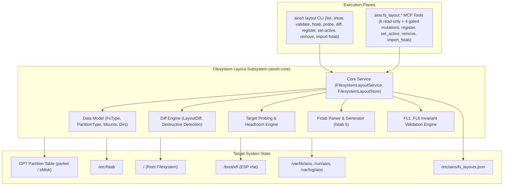

# AIOS Filesystem Layout Subsystem: Architecture & Operational Guide

## 1. Executive Overview & Architectural Role

Phase 1 of AIOS establishes the foundational Linux base operating system and bootable target. The **Filesystem Layout Subsystem** (`aiosh-core::fs_layout` and `aiosh-core::fs_layout_service`) governs the storage partitioning topology, filesystem driver classification, mount hierarchy specifications, `/etc/fstab` configuration, directory permissions, CIS benchmark mount security, target disk feasibility probing, differential comparison, and atomic configuration persistence:

- **Partition Topology**: Governs GPT partition tables, EFI System Partition (ESP), root partitions, swap space, and custom storage slices.
- **Filesystem Hierarchy Standard (FHS 3.0) & UsrMerge**: Canonical directory structures with UsrMerge compatibility symlinks (`/bin -> usr/bin`, `/sbin -> usr/sbin`, `/lib -> usr/lib`).
- **Standard Linux `fstab(5)` Semantics**: Exact 6-field lossless serialization and parsing (`device`, `mount_point`, `fs_type`, `options`, `dump`, `pass`).
- **CIS Benchmark Compliance**: Mandatory security options (`nodev`, `nosuid`, `noexec`) on temporary and shared filesystems (`/tmp`, `/dev/shm`).
- **Target Feasibility Probing**: Computes partition budget allocations against physical or virtual block device capacities and warns on tight storage headroom (< 10% slack).
- **Differential Analysis (`LayoutDiff`)**: Evaluates migration deltas across partitions, mounts, and directories, flagging destructive mutations (partition shrinking, deletions, or filesystem reformatting).
- **Atomic Persistence**: Thread-safe, crash-resilient store persistence with temporary sibling files (`.tmp.<pid>`) and atomic filesystem renaming.
- **AIOS Operational Runtimes**: Standard persistent state in `/var/lib/aios`, volatile IPC sockets in `/run/aios`, configurations in `/etc/aios`, and tamper-evident audit logs in `/var/log/aios`.



---

## 2. Core Service & Data Model

The implementation resides across two modules:
- [`code/aiosh-rust/aiosh-core/src/fs_layout.rs`](file:///c:/Users/OBSESSION/Desktop/AIOS_MERGED/code/aiosh-rust/aiosh-core/src/fs_layout.rs): Data structures, GPT GUID mappings, fstab parser/serializer, and FL1..FL6 validators.
- [`code/aiosh-rust/aiosh-core/src/fs_layout_service.rs`](file:///c:/Users/OBSESSION/Desktop/AIOS_MERGED/code/aiosh-rust/aiosh-core/src/fs_layout_service.rs): Service coordinator, store registry, target disk evaluation, layout diffing, and persistence.

### 2.1 Core Types & Entities

1. **`FilesystemLayoutStore`**:
   - Manages profile registry (`BTreeMap<String, FilesystemLayoutSpec>`).
   - Tracks `active_layout_id: String` (defaults to `aios-uefi-standard-v1`).
   - Methods: `register_layout()`, `get_layout()`, `list_layouts()`, `remove_layout()`, `get_active_layout()`, `set_active_layout()`.
   - The store *document* refuses unknown top-level fields at load, by name (T-01544; §6.22). Field set unchanged.
2. **`FilesystemLayoutService`**:
   - `probe_target(layout_id, target_disk_bytes) -> Result<TargetEvaluation, String>`
   - `diff_layouts(source_id, target_id) -> Result<LayoutDiff, String>`
   - `export_fstab(layout_id) -> Result<String, String>`
   - `import_fstab_as_layout(id, name, fstab_content, base_layout_id) -> Result<FilesystemLayoutSpec, String>`
   - `save_to_path(path) -> Result<(), String>`
   - `load_from_path(path) -> Result<Self, String>`
3. **`TargetEvaluation`**:
   - Evaluates block device size against `target_disk_min_bytes` and sum of partition allocations using saturating arithmetic.
   - Emits warnings when free slack headroom is below 10%.
4. **`LayoutDiff`**:
   - Itemized delta across partitions, mounts, and directories.
   - `destructive: bool` dynamically set if partitions are removed or shrunk, or if filesystem types change.

---

## 3. Invariant Systems

### 3.1 Data Model Invariants (`FL1..FL6`)
1. **`FL1` (Single Root Mount)**: Exactly one entry in `mounts` must have `path == "/"`, and its pass number must be `1`. Non-root entries cannot have pass number `1`.
2. **`FL2` (Path Hygiene)**: All paths must be absolute, cannot contain relative traversals (`.` or `..`), double slashes (`//`), control characters, or trailing slashes (except `/`).
3. **`FL3` (Mount Hierarchy Topology)**: No duplicate mount point paths. Ancestor mounts must precede descendant mounts (e.g. `/` before `/boot`, `/boot` before `/boot/efi`).
4. **`FL4` (CIS Security Mount Options)**: Mount points `/tmp` and `/dev/shm` must include `nodev`, `nosuid`, and `noexec` (T-01542 D3).
5. **`FL5` (Partition Constraints)**: Partition indices $1 \le \text{index} \le 128$ and unique; total partition size bounded by target disk capacity;
6. **`FL6` (Required-Mount Floor, T-01542 D8)**: At least one entry in `mounts` must have `required: true`. A layout with no required mount cannot be operationally ready. Per-element field checks (dump ∈ {0,1}; directory mode ∈ 1..=0o7777; UsrMerge-shaped `symlink_target`; RFC 3339 UTC `created_at`) are unnumbered by convention, as are their existing siblings. ESP partition must be $\ge 100$ MiB and formatted as `vfat`.

### 3.2 Core Service Invariants (`CS1..CS5`)
1. **`CS1` (Store Integrity)**: Active layout must always point to a registered layout; built-in presets (`standard_uefi`, `minimal_container`) cannot be deleted; active layout cannot be deleted.
2. **`CS2` (Target Geometry Feasibility)**: Target block device must satisfy both layout minimum bytes and partition allocation sum.
3. **`CS3` (Destructive Delta Flagging)**: Any layout diff that shrinks or deletes partitions or alters mount filesystems must flag `destructive = true`.
4. **`CS4` (Fstab Ordering & Import Hygiene)**: Generated fstab must preserve topological depth order; imported fstab files are capped at $\le 128$ entries.
5. **`CS5` (Atomic Persistence)**: Files are written to `.tmp.<pid>` sibling files and renamed atomically; ingestion is bounded to $\le 10$ MiB.

---

## 4. CLI Operator Reference (`aiosh layout`)

Every read subcommand resolves one layout from, in order of precedence: a positional `ID` present in
the store, `--spec <file_or_json>`, `--container` (the `minimal_container` preset), `--standard` (the
`standard_uefi` preset), or — when no selector is given — the store's **active** layout.

### 4.1 List Registered Layouts
```bash
aiosh layout list
aiosh layout list --json
```

### 4.2 Show Layout Specification
```bash
# Show default active layout
aiosh layout show

# Show container layout
aiosh layout show --container --json

# Show custom specification
aiosh layout show --spec /etc/aios/layout.json
```

### 4.3 Validate Layout Specification
```bash
# Validate active layout
aiosh layout validate

# Validate custom file
aiosh layout validate --spec /etc/aios/layout.json --json
```

### 4.4 Probe Target Block Device
```bash
# Probe 100 GiB storage target against active layout
aiosh layout probe --bytes 107374182400

# Probe container target
aiosh layout probe --container --bytes 10737418240 --json
```

### 4.5 Differential Comparison
```bash
# Compare standard UEFI vs container layout
aiosh layout diff aios-uefi-standard-v1 aios-container-minimal-v1
aiosh layout diff aios-uefi-standard-v1 aios-container-minimal-v1 --json
```

### 4.6 Generate `/etc/fstab`
```bash
aiosh layout fstab
aiosh layout fstab --container
```

### 4.7 Register a Custom Layout Profile
```bash
# Register from a JSON spec file
aiosh layout register --spec ./layout.json --store ./layouts.json --json

# Register from inline JSON
aiosh layout register --store ./layouts.json --json \
  --spec '{"id":"lab-vm-v1","name":"Lab VM","description":"Nested virt host","target_disk_min_bytes":34359738368,"partitions":[],"mounts":[{"path":"/","device":"LABEL=AIOS_ROOT","fs_type":"ext4","options":["rw","relatime"],"dump":0,"pass":1,"required":true}],"directories":[],"created_at":"2026-09-17T00:00:00Z"}'
```

`--spec` accepts either the path of an existing regular file or the JSON document itself. The
specification is validated against `FL1..FL6` **before** it enters the store, and duplicate ids are
refused (`REGISTER_FAILED`). Nothing reaches disk unless `--store` is supplied (see §6.7).

### 4.8 Switch the Active Layout
```bash
aiosh layout set-active lab-vm-v1 --store ./layouts.json
```
Both ids are reported (`previous_active` → `active`) and the new pointer is persisted. An unknown id
fails with `SET_ACTIVE_FAILED`.

### 4.9 Remove a Layout Profile
```bash
aiosh layout remove lab-vm-v1 --store ./layouts.json
```
Two refusals, both `REMOVE_FAILED` and both non-destructive: the **currently active** layout cannot be
removed (switch active first), and the canonical presets `aios-uefi-standard-v1` /
`aios-container-minimal-v1` are permanent.

### 4.10 Import an Existing `/etc/fstab`
```bash
# Inherit partitions and directories from the active layout
aiosh layout import-fstab lab-vm-v2 "Lab VM (imported)" --fstab ./fstab.sample --store ./layouts.json

# ...or from a named base profile
aiosh layout import-fstab lab-vm-v2 "Lab VM (imported)" --base aios-uefi-standard-v1 \
  --fstab ./fstab.sample --store ./layouts.json
```

Each usable line is parsed with `fstab(5)` rules (six fields, `#` comments and blanks skipped). At most
128 mount entries are accepted, and content that yields no usable rows is rejected with
`IMPORT_FAILED`. `--fstab` takes either a file path or the fstab content itself.

### 4.11 End-to-End Lifecycle Walkthrough
```bash
STORE="$PWD/layouts.json"

aiosh layout validate --standard                          # canonical preset satisfies FL1..FL6
aiosh layout list --store "$STORE"                        # file absent: in-memory presets are listed
aiosh layout register --spec ./layout.json --store "$STORE"
aiosh layout set-active lab-vm-v1 --store "$STORE"
aiosh layout probe lab-vm-v1 --bytes 214748364800 --store "$STORE"
aiosh layout diff aios-uefi-standard-v1 lab-vm-v1 --store "$STORE"
aiosh layout fstab --store "$STORE" > fstab.generated
aiosh layout remove lab-vm-v1 --store "$STORE"            # refused: it is the active layout
aiosh layout set-active aios-uefi-standard-v1 --store "$STORE"
aiosh layout remove lab-vm-v1 --store "$STORE"            # now accepted
```

### 4.12 Exit Codes & Standard Error Codes

| Exit | Meaning | Codes |
|---|---|---|
| `0` | success | — (the envelope carries `data`) |
| `1` | operational, validation, or I/O failure | `RESOLVE_FAILED`, `VALIDATION_FAILED`, `DIFF_FAILED`, `PROBE_FAILED`, `NOT_VIABLE`, `LOAD_STORE_FAILED`, `SAVE_STORE_FAILED`, `REGISTER_FAILED`, `SET_ACTIVE_FAILED`, `REMOVE_FAILED`, `IMPORT_FAILED`, `SPEC_READ_FAILED`, `SPEC_NOT_REGULAR_FILE`, `SPEC_SIZE_EXCEEDED`, `SPEC_PARSE_FAILED`, `FSTAB_READ_FAILED`, `FSTAB_NOT_REGULAR_FILE`, `FSTAB_SIZE_EXCEEDED` |
| `2` | argument error (the store is never touched) | `ARGUMENT_ERROR`, `INVALID_ARGUMENT`, `UNKNOWN_SUBCOMMAND` |

With `--json`, every invocation prints exactly one envelope —
`{"code": 0|1|2, "data": {...}|null, "error": null|{"code": "...", "message": "..."}}` — so a wrapper
can branch on the exit status and the inner `error.code` without parsing prose. Without `--json`,
results go to stdout and diagnostics to stderr. Every invocation, successful or not, also appends one
hash-chained row to the SQLite audit ring at `$AIOSH_HOME/audit.db`.

---

## 5. MCP Tool Reference (`aios.fs_layout.*`)

MCP is the only tool-call protocol AIOS exposes (ADR-0035 §D-2), so this is the surface an agent
uses; `aiosh layout` (§4) is the operator equivalent. The Filesystem Layout component exposes **ten**
tools — six read-only and four that mutate a layout store.

Every call is one JSON-RPC 2.0 object per line on stdio:

```json
{"jsonrpc":"2.0","id":1,"method":"tools/call","params":{"name":"aios.fs_layout.list","arguments":{}}}
```

and every call answers in the standard result envelope described in §5.11.

### 5.0 Surface at a Glance

| Tool | Effect | Grant | `store_path` | Audit target |
|---|---|---|---|---|
| `aios.fs_layout.get` | reads a stored layout or a built-in preset | optional | optional | layout id |
| `aios.fs_layout.list` | reads the store | optional | optional | active layout id |
| `aios.fs_layout.validate` | validates a document (never reads the store) | optional | bound-checked only | layout id |
| `aios.fs_layout.fstab` | renders `/etc/fstab` from a document | optional | — | layout id |
| `aios.fs_layout.probe` | evaluates a layout against a target disk size | optional | optional | layout id |
| `aios.fs_layout.diff` | differential comparison of two layouts | optional | optional | source → target ids |
| `aios.fs_layout.register` | **writes** a new layout into the store | **required** | **required** | new layout id |
| `aios.fs_layout.set_active` | **writes** the active-layout pointer | **required** | **required** | layout id |
| `aios.fs_layout.remove` | **writes** by deleting a layout | **required** | **required** | layout id |
| `aios.fs_layout.import_fstab` | **writes** a layout imported from fstab text | **required** | **required** | new layout id |

Four rules govern the mutating half; each is enforced in code, not by convention:

1. **A PEP grant is required, twice over.** The call site passes `require_grant = true` *and* the
   four ids are listed in `pep::is_irreversible`, so an unauthenticated mutation is refused by the
   policy engine itself even if a call site ever forgot the flag.
2. **`store_path` is mandatory.** No canonical default store exists yet (the configuration sub-epic
   `T-01541..` owns that default), so a mutation without an explicit path is **refused** rather than
   performed against a throw-away in-memory store whose discard the caller could not see. This is
   the deliberate difference from the CLI, which does mutate in memory (§6.7).
3. **`scope.paths` governs the paths the call touches** — the store it writes plus the `spec`/`fstab`
   document it reads when that names an existing file — not the layout id the row is attributed to.
   Matching is *canonical*: case, 8.3 short names, trailing dot/space and device/extended-length
   spellings of the same location all resolve to one policy key, so a deny entry cannot be evaded by
   re-spelling it. The entry and the argument must also be written in the same frame (relative with
   relative, absolute with absolute), and `.` is not a usable entry (§6.21). Reads stay ungated
   (§6.16).
4. **There is no dry-run.** An accepted mutation persists immediately; `aios.fs_layout.probe` and
   `aios.fs_layout.diff` are the read-only ways to evaluate a change first.

The four mutations declare `required` arguments in their schemas (`store_path`; plus `layout_id` or
`layout_id`+`name`+`fstab`), so a client can pre-assemble a valid call. Note that argument
*validation* is narrower than the schema suggests in one respect — see §6.15.

### 5.1 `aios.fs_layout.list`
```json
{
  "name": "aios.fs_layout.list",
  "arguments": {}
}
```

### 5.2 `aios.fs_layout.probe`
```json
{
  "name": "aios.fs_layout.probe",
  "arguments": {
    "layout_id": "aios-uefi-standard-v1",
    "target_disk_bytes": 107374182400
  }
}
```

### 5.3 `aios.fs_layout.diff`
```json
{
  "name": "aios.fs_layout.diff",
  "arguments": {
    "source_id": "aios-uefi-standard-v1",
    "target_id": "aios-container-minimal-v1"
  }
}
```

### 5.4 `aios.fs_layout.get`
```json
{
  "name": "aios.fs_layout.get",
  "arguments": {
    "profile": "standard_uefi"
  }
}
```

### 5.5 `aios.fs_layout.validate`
```json
{
  "name": "aios.fs_layout.validate",
  "arguments": {
    "layout": {
      "id": "aios-uefi-standard-v1",
      "name": "Reference Host",
      "description": "Standard layout",
      "target_disk_min_bytes": 68719476736,
      "partitions": [],
      "mounts": [
        {
          "path": "/",
          "device": "LABEL=AIOS_ROOT",
          "fs_type": "ext4",
          "options": ["rw", "relatime"],
          "dump": 0,
          "pass": 1,
          "required": true
        }
      ],
      "directories": [],
      "created_at": "2026-09-16T00:00:00Z"
    }
  }
}
```

### 5.6 `aios.fs_layout.fstab`
```json
{
  "name": "aios.fs_layout.fstab",
  "arguments": {
    "profile": "standard_uefi"
  }
}
```

### 5.7 `aios.fs_layout.register`  *(mutation — grant + `store_path` required)*

```json
{
  "name": "aios.fs_layout.register",
  "arguments": {
    "spec": "/path/to/layout.json",
    "store_path": "/path/to/layouts.json",
    "grant_id": "gr_..."
  }
}
```

Registers one new profile. `layout` (an inline JSON object) takes precedence over `spec` (a path to a
regular file, or inline JSON). The document must carry only schema-known fields (unknown JSON fields are refused, T-01542 D1 — the same typo protection the MCP tool schemas advertise). `register_layout` re-runs the full `FL1..FL6` validation and refuses a
duplicate id. The row is attributed to the **new layout id on both outcome paths** (a duplicate-id
refusal is still findable by layout), except for a *pre-gate* refusal — a call with no grant cannot
name the id, because resolving it would mean parsing the caller's path before authorization.

```json
{
 "audit_id": 4,
 "active_layout_id": "aios-uefi-standard-v1",
 "id": "lab-vm-v1",
 "ok": true,
 "registered": true,
 "tool": "aios.fs_layout.register"
}
```

### 5.8 `aios.fs_layout.set_active`  *(mutation — grant + `store_path` required)*

```json
{
  "name": "aios.fs_layout.set_active",
  "arguments": { "layout_id": "lab-vm-v1", "store_path": "/path/to/layouts.json", "grant_id": "gr_..." }
}
```

Moves the active-layout pointer to an already-registered id and **persists** it. The destructive
verdict of the transition is *reported, never blocked*: `destructive_transition` is `true` when the
move removes or shrinks partitions, changes a filesystem, or repoints `/`, and `null` when it cannot be
computed (an empty previous id). Use `aios.fs_layout.diff` to inspect the delta before committing.

```json
{
 "audit_id": 5,
 "active": "lab-vm-v1",
 "destructive_transition": true,
 "ok": true,
 "previous_active": "aios-uefi-standard-v1",
 "tool": "aios.fs_layout.set_active"
}
```

### 5.9 `aios.fs_layout.remove`  *(mutation — grant + `store_path` required)*

```json
{
  "name": "aios.fs_layout.remove",
  "arguments": { "layout_id": "lab-vm-v1", "store_path": "/path/to/layouts.json", "grant_id": "gr_..." }
}
```

Deletes a profile. Refused for the **active** layout and for the two built-in canonical presets, so
the store can never be left without a usable active layout by this path:

```json
{
 "audit_id": 12,
 "error": "cannot remove active layout 'lab-vm-v1'; switch active layout first",
 "ok": false,
 "tool": "aios.fs_layout.remove"
}
```

### 5.10 `aios.fs_layout.import_fstab`  *(mutation — grant + `store_path` required)*

```json
{
  "name": "aios.fs_layout.import_fstab",
  "arguments": {
    "layout_id": "lab-vm-v2",
    "name": "Imported from fstab",
    "fstab": "/path/to/fstab.sample",
    "store_path": "/path/to/layouts.json",
    "grant_id": "gr_..."
  }
}
```

Builds a new profile whose mount rows come from the fstab document (`fstab` names a regular file or
carries inline content) while partitions and directories are inherited from `base_layout_id` — or,
when that is absent, from the store's **active** layout. At most 128 mount rows; a malformed row is
refused by line number rather than skipped. The imported profile's `created_at` is a fixed import
timestamp, not the wall clock.

### 5.11 Result Envelope, Refusals and Audit Rows

Every call — read or mutation, accepted or refused — answers with **one** JSON-RPC result carrying a
structured envelope, and every call that reaches the gate writes **exactly one** hash-chained row to
`$AIOSH_HOME/audit.db`. There is no silent-failure path: a refusal is an explicit object with
`ok:false` and a reason, not an empty read. The one exception to the row rule is an unknown tool
name, which is refused *before* the gate and leaves no row at all (last case below).

**Success** (`isError: false`):

```json
{ "ok": true, "tool": "aios.fs_layout.list", "audit_id": 3, "count": 2, "active_layout_id": "aios-uefi-standard-v1", "layouts": [ ... ] }
```

**Body refusal** — the call was authorized but the operation was invalid. `isError: true`:

```json
{ "ok": false, "tool": "aios.fs_layout.remove", "audit_id": 12, "error": "cannot remove active layout 'lab-vm-v1'; switch active layout first" }
```

**Gate refusal** — the classifier or the policy engine stopped the call before the body ran. Note the
`gate` and `policy_revision` fields in place of `error`. `isError: true`:

```json
{ "ok": false, "tool": "aios.fs_layout.register", "audit_id": 13, "gate": "pep", "policy_revision": "sprint-2-rule-pack-v1", "reason": "tool 'aios.fs_layout.register' requires explicit PEP grant" }
```

**Unknown tool** — refused before the gate, so there is no per-tool envelope **and no audit row**;
this is the only request on this surface that leaves no forensic record:

```json
{ "ok": false, "error": "unknown tool: aios.fs_layout.nope" }
```

The `audit_id` carried by the three envelopes above is the row's key, which makes a call and its
forensic record joinable — and its absence is exactly how you recognise the no-row case. Check chain
integrity with `aiosh audit verify --json` (`data.ok`), and read rows with
`aiosh audit tail --json -n <n>`.

### 5.12 Copy-Pasteable End-to-End MCP Session

Executed verbatim on this repository's build (see the `T-01539` evidence file, §2). One line of
JSON-RPC per request; the server answers one line per request.

Run from the repository root; it creates `demo/` and `.aios-demo/` under the current directory. The
paths are deliberately **relative and identically spelled** on the grant and the call, and the allow
entry names the sub-directory rather than `.` — see the spelling caveats in §6.20–§6.21 before
substituting other paths:

```bash
export AIOSH_HOME="$PWD/.aios-demo"; mkdir -p "$AIOSH_HOME" demo
export PATH="$PWD/code/aiosh-rust/target/debug:$PATH"

# 1. Mint a grant scoped to the directory the store and spec will live in.
GRANT=$(aiosh grant create --to agent:fs-layout-demo --tools 'aios.fs_layout.*' --allow demo \
  | python3 -c 'import json,sys; print(json.load(sys.stdin)["data"]["grant_id"])')
echo "grant: $GRANT"

# 2. Derive a spec from the canonical container preset.
aiosh layout show aios-container-minimal-v1 --json | python3 -c \
  'import json,sys; s=json.load(sys.stdin)["data"]; s["id"]="lab-vm-v1"; s["name"]="Lab VM"; print(json.dumps(s))' \
  > demo/layout.json

# 3. Drive the MCP server over stdio: register, then list.
{
  printf '%s\n' "{\"jsonrpc\":\"2.0\",\"id\":1,\"method\":\"tools/call\",\"params\":{\"name\":\"aios.fs_layout.register\",\"arguments\":{\"spec\":\"demo/layout.json\",\"store_path\":\"demo/layouts.json\",\"grant_id\":\"$GRANT\"}}}"
  printf '%s\n' "{\"jsonrpc\":\"2.0\",\"id\":2,\"method\":\"tools/call\",\"params\":{\"name\":\"aios.fs_layout.list\",\"arguments\":{\"store_path\":\"demo/layouts.json\"}}}"
} | aiosh-mcp
```

The first response registers the profile with a new `audit_id`; the second reports `count: 3`
(the two built-in presets plus `lab-vm-v1`). Omitting `grant_id` from the first call turns it into the
PEP refusal shown in §5.11 — the layout is then **not** written, which is the behaviour to rely on
when testing a client. The `T-01534`/`T-01537`/`T-01538`/`T-01539` evidence files walk the same
surface end to end (register → set-active → probe → diff → fstab → refused removal).

---

## 6. Constraints & Known Limitations

1. **Declarative Management**: The core service provides control, verification, diffing, and fstab generation in user space. Direct physical disk formatting (`mkfs.*`, `parted`) requires root capabilities and is governed by subsequent disk target execution tasks. The CLI spawns **no external processes**.
2. **Cardinality Caps**: Specifications are bounded to $\le 128$ partitions, $\le 128$ mount points, and $\le 1024$ directories. `/etc/fstab` import additionally accepts at most $\le 128$ mount rows.
3. **Persistence Size Limit**: Layout store JSON files loaded via `load_from_path` or CLI `--spec` are capped at 10 MiB to prevent memory exhaustion attacks.
4. **Built-in Preset Immutability**: Canonical presets `aios-uefi-standard-v1` and `aios-container-minimal-v1` cannot be deleted from the store.
5. **Regular-File Inputs Only**: `--spec`, `--fstab`, and `--store` must name regular files (or, for `--spec`/`--fstab`, hold inline content). A directory, FIFO, or character device is refused by type (`SPEC_NOT_REGULAR_FILE`, `FSTAB_NOT_REGULAR_FILE`, `LOAD_STORE_FAILED`) instead of being read: a FIFO with no writer would block the CLI forever, and `/dev/zero` would stream until memory is exhausted. Symlinks to regular files are still readable; the write path never follows a pre-existing link.
6. **Read Caps Apply During the Read**: The 10 MiB document ceiling is enforced on the byte stream (read `cap + 1` bytes, reject on overflow), not merely from a metadata snapshot that a pseudo-file can under-report.
7. **Mutations Require `--store`**: `register`, `set-active`, `remove`, and `import-fstab` without `--store` operate on a process-local in-memory store seeded with the two canonical presets. They report success, but the change is discarded when the process exits. Always pass `--store <path>` when a change must survive.
8. **Single-Writer Assumption**: There is no cross-process lock on the store file. Two concurrent mutating invocations can lose one update (the last atomic rename wins), so serialize writers that share a store.
9. **Crash Residue and Recovery**: Persistence stages bytes in a sibling `.<name>.tmp.<pid>.<nanos>.<n>` file, flushes it to stable storage, then renames it over the store — so the destination is always either the old or the new *complete* document, never truncated. If the **rename** (not the write) fails, the staged file is deliberately preserved and its path is named in the error; use that file to recover the state that could not be installed. A crash between write and rename can leave one inert staged file beside the store, which is safe to delete. Names are unguessable and created with `O_CREAT | O_EXCL`, and no sweep-by-pattern is offered, because a pattern-based unlink would reintroduce an attacker-influenced deletion primitive.
10. **Windows DOS Device Names**: `Path::new("NUL").exists()` is false on Windows, so `--store NUL` takes the documented "store file missing → canonical presets" path. Nothing is read from or written to the device.
11. **Platform Coverage of the Hardening Proofs**: The FIFO / character-device, read-only-directory, and symlink-at-destination proofs in the CLI hardening suite are POSIX-only and are reported as `SKIP` on Windows. The equivalent core properties (rename-failure preservation, atomic replacement with no residue, non-regular-file rejection with a read-time cap) are asserted on every platform — see [T-01528](file:///c:/Users/OBSESSION/Desktop/AIOS_MERGED/docs/tasks/evidence/T-01528-cli-surface-hardening.md) §3.2.
12. **Write-Side Ceiling (10 MiB) and the Sealed-Store Consequence**: the store that is written must
    also be ≤ 10 MiB — the serialized bytes are measured *before* anything is staged, and a larger
    store is refused with an explicit error naming the read ceiling, leaving the existing store
    untouched. This closed a real defect (a store could previously be saved past its own read
    ceiling and then never loaded again, while the call reported success). **The gap that remains:**
    a store that is *already* over the ceiling — written before this bound existed, or by another
    writer — cannot be loaded by any tool, and since every tool loads before writing, **no tool can
    repair it**. Recovery is external: delete it, or edit it down with `python3 -c '...'`/an editor,
    then continue. There is no `aiosh` repair command for this case.
13. **Staged-Residue Cap, Keyed on the Physical Destination**: a failed atomic replace deliberately preserves its
    staged `.<name>.tmp.<pid>.<nanos>.<n>` file (it may be the only complete copy of the caller's
    state) and names it in the error. At most 8 such files are tolerated beside one destination before
    staging is refused, so repeated failures cannot fill the directory; nothing is ever auto-deleted,
    because a sweep-by-pattern would reintroduce an attacker-influenced deletion primitive. The cap is
    charged to a **canonical destination key**, not the spelled name: the first cut keyed on the
    *spelled* file name and was evadable by spelling (case variants, trailing dot/space, 8.3 short
    names, and a nesting prefix together accumulated 32 staged files around one destination where 8 was
    the cap — found by the `T-01539` adversarial verification, fixed after it). Staged files are now
    re-anchored to the destination they were staged for and grouped by
    `fs_layout_service_key::canonical_store_key`, the same existing-prefix filesystem resolution the
    `scope.paths` matcher trusts, so aliases of one destination share one budget in both directions;
    genuinely different stores whose *spelled* names nest (`s.json`, `s.json.tmp`) key apart and cannot
    trip each other's cap. Two honest boundaries: where the volume itself distinguishes spellings
    (8.3 short names disabled, as on the development host) those are genuinely different destinations
    and get their own budget by design — the filesystem, not this code, decides what is an alias; and
    a directory-listing failure is reported rather than treated as "no residue", since a guard that
    silently reports zero would be the same class of dishonesty this cap exists to prevent.
14. **Bounded Replace Retry, and What It Does Not Bound**: a failing final rename is retried at most
    5 times with a doubling backoff (20 ms → 160 ms, budget 5 s) and only for errors that look
    transient (`PermissionDenied`/`WouldBlock`; Windows `5`/`32`/`33`; POSIX `EBUSY`/`ETXTBSY`/
    `EAGAIN`/`EINTR`). Two caveats stated rather than implied: on Windows a **permanent** condition
    (a read-only destination file) reports the same `os error 5` as a momentary lock, so it is retried
    before being refused (~0.4 s observed, error still surfaced, never masked); and a syscall blocked
    inside the kernel (an unresponsive network mount) is not interruptible from this layer, so the
    budget bounds the retry loop, not the syscall.15. **Undeclared *Tool* Arguments Are Ignored, Not Refused; Unknown *Spec* Fields Are Refused**: all ten tools advertise
`"additionalProperties": false`, but the server does not enforce it — an unknown tool-level key is silently
ignored and the call proceeds. This is not harmless in one direction: an agent sending
`{"dry_run": true}` to `aios.fs_layout.register` gets a **real, persisted mutation**. Do not rely
on the schema for typo or vocabulary protection; check the tool table in §5.0. The *layout document itself* is the other half of that closure (T-01542 D1): every spec struct rejects unknown JSON fields, so a typo'd field name inside `layout`/`spec` now fails registration with the offending name in the error instead of validating a document that means something other than what was written. The *store document* joined the same contract in T-01544 (§6.22): unknown top-level store fields are refused at load, so the store file is no longer the one parse path that tolerates a field it does not know.
16. **Read Tools Are Ungated, and CLI-Written Text Is Not Classified**: `get`, `list`, `validate`,
    `fstab`, `probe` and `diff` run with `require_grant = false`, and `validate`/`fstab` accept a
    caller-named `spec` document. The read is bounded and type-checked (regular files only, ≤ 10 MiB,
    and only content that parses as a layout is returned), so this is a local information-disclosure
    surface rather than an escape — but an operator who wants it constrained **cannot express that with
    a grant today**, because an ungated call consults no grant. Separately, text written into a store
    by the operator CLI bypasses the classifier, and `get`/`list` echo it back; rendering neutralizes
    control characters, while `--json` output and the store stay faithful by design.
17. **Single-Writer Assumption (MCP)**: as with the CLI (§6.8) there is no cross-process lock on the
    store. Two writers that share a `store_path` can in principle lose one update (last rename wins);
    in 12/12 probed trials both concurrent writers reported success and **both** updates survived, and
    no trial produced a store over the ceiling — but the read-modify-write window is structural, so
    serialize writers per store rather than relying on that observation.
18. **Audit-Ring Durability Is a Platform Property, Not a Layout One**: every fs_layout call writes
    exactly one hash-chained row (success, body refusal and gate refusal alike — but **not** an
    unknown tool name, which is refused before the ring and leaves no row, §5.11) and
    `aiosh audit verify` stayed `ok` across this surface's probes. The ring's *cross-cutting* defects
    under concurrency — a forked chain, a row that can be lost after a mutation, a panic on a busy
    ring (`F-02`/`F-06`/`F-16` of the 2026-09-18 security audit) — belong to `dispatch`/`audit` and
    are shared by ~130 tools; they remain open there, not fixed here.
19. **Payload Ceilings**: an inline `layout`/`spec`/`fstab` document is capped at 1 MiB
    (`MAX_INLINE_LAYOUT_BYTES`), the transport rejects a request line beyond 1 MiB, and a document read
    from disk is capped at 10 MiB *during* the read. All three are refusals with named reasons, not
    truncations.
20. **A Path Must Mean One Thing to the Process That Runs the Tool**: `scope.paths` matching is
    canonical *relative to the filesystem the binary sees*. Two spellings that look equivalent to a
    shell are not necessarily equivalent to a native process — under Git Bash/MSYS, `$PWD` is
    `/tmp/...` or `/c/...`, which a native Windows binary resolves against its own notion of the
    current drive (a `/tmp/...` path can mean `C:\tmp\...`, a different directory entirely). Passing
    such a spelling as `--allow` and then the same spelling as a tool argument therefore produces an
    out-of-scope refusal for a path the caller believes is inside the grant, and the tool never
    touches the file. **Use one spelling that resolves to the intended location for the binary** —
    the examples in §5.12 use bare relative paths for exactly this reason — and treat an unexpected
    "blocked by grant `scope.paths`" as a path-identity signal first, not a policy bug. This is the
    same spelling-versus-identity distinction the canonicalisation in `T-01537` (F-1/F-7) closed for
    aliases of an existing path; a spelling the process cannot resolve is outside that closure.
21. **A `.` Entry Means the Working Directory**: `.` is the obvious way to say "this directory", and
    `aiosh grant create --allow .` is accepted and recorded — but the entry *used* to authorize
    nothing. Normalisation dropped `.` components, so the key for `.` was the **empty string**, and a
    path matched an entry only when the path's key *equalled* the entry's or *started with*
    `<entry>/`. That was fail-closed but useless on Windows — `--allow .` refused its own directory's
    store for both a relative (`layouts.json`) and an absolute argument, `path subject 'layouts.json'
    blocked by grant scope.paths` — and **fail-open** wherever the target key is root-relative, since
    containment on `""` degenerates to `starts_with("/")`. That fail-open was never POSIX-only:
    any key the process could not resolve (`/…/secret.json`) satisfied it on Windows too.
    `pep::normalize_path_str` now keys `.` (and `./`, `a/..`) to the working directory, keeps a
    leading `..` as the real parent instead of collapsing it to the current directory, and the
    matcher refuses an empty key in both directions, so no spelling can turn an entry into a
    wildcard. Measured over the real binaries with `AIOSH_HOME` isolated: `--allow .` lets a
    `register` write `layouts.json` **and** an absolute `…\demo\layouts.json`, while `../outside/…`
    and an absolute path outside it are refused with nothing written; with `--deny .` a store in the
    working directory is refused and a store outside it is allowed. A relative entry and a relative
    argument are anchored to the working directory too, so the two no longer have to be spelled in
    the same frame (`.`, `demo`, `demo/x.json` and the absolute forms now compare consistently).
    The **Python** and **TypeScript** matchers (`audit_client.py:path_allowed`,
    `pep.ts:pathAllowed`) are still purely lexical: they compare strings, so `.` matches no target
    there — fail-closed, never fail-open.
22. **The Store Document Refuses Unknown Fields Too, and an Unloadable Store Is Not Repairable In-Tool**:
    T-01542 D1 put unknown-field rejection on every *spec* struct; T-01544 extends the same rule to the
    store **document** (`FilesystemLayoutStore`). A store spelling `active_layout` instead of
    `active_layout_id` used to load successfully and silently keep the built-in default active layout —
    a typo mutated a store that meant something other than what it said. It is now refused by name at
    load (`failed to deserialize layout store from '<path>': unknown field \`active_layout\`, expected …`),
    and nothing from the refused document is loaded. The field *set* is unchanged, so a store this tool
    wrote still loads unchanged; every write path emits only the two known keys. Two honest boundaries
    follow from the same choice as §6.12: a store carrying an unknown key — hand-edited, or written by a
    *newer* version that added a field — **cannot be loaded by any tool, and no tool can repair it**,
    because every tool loads before it writes; recovery is external (drop the unknown key with an editor
    or `python3 -c '…'`), exactly as for the over-ceiling store. And the refusal is deliberately *not* a
    warn-and-continue: continuing is the silent misreading this rule exists to remove.

---

## 7. Task Evidence & Audit Trail

### Sub-Epic 1: Filesystem Layout Data Model (T-01501..T-01510)
- `T-01501`: [Data Model Research](file:///c:/Users/OBSESSION/Desktop/AIOS_MERGED/docs/tasks/evidence/T-01501-data-model-research.md)
- `T-01502`: [Data Model Specification](file:///c:/Users/OBSESSION/Desktop/AIOS_MERGED/docs/tasks/evidence/T-01502-data-model-specification.md)
- `T-01503`: [Data Model Scaffold](file:///c:/Users/OBSESSION/Desktop/AIOS_MERGED/docs/tasks/evidence/T-01503-data-model-scaffold.md)
- `T-01504`: [Data Model Implementation](file:///c:/Users/OBSESSION/Desktop/AIOS_MERGED/docs/tasks/evidence/T-01504-data-model-implementation.md)
- `T-01505`: [Data Model Unit Tests](file:///c:/Users/OBSESSION/Desktop/AIOS_MERGED/docs/tasks/evidence/T-01505-data-model-unit-test.md)
- `T-01506`: [Data Model Integration](file:///c:/Users/OBSESSION/Desktop/AIOS_MERGED/docs/tasks/evidence/T-01506-data-model-integration.md)
- `T-01507`: [Data Model Security Review](file:///c:/Users/OBSESSION/Desktop/AIOS_MERGED/docs/tasks/evidence/T-01507-data-model-security-review.md)
- `T-01508`: [Data Model Hardening](file:///c:/Users/OBSESSION/Desktop/AIOS_MERGED/docs/tasks/evidence/T-01508-data-model-hardening.md)
- `T-01509`: [Data Model Documentation](file:///c:/Users/OBSESSION/Desktop/AIOS_MERGED/docs/tasks/evidence/T-01509-data-model-documentation.md)
- `T-01510`: [Data Model Verification](file:///c:/Users/OBSESSION/Desktop/AIOS_MERGED/docs/tasks/evidence/T-01510-data-model-verification-evidenc.md)

### Sub-Epic 2: Filesystem Layout Core Service (T-01511..T-01520)
- `T-01511`: [Core Service Research](file:///c:/Users/OBSESSION/Desktop/AIOS_MERGED/docs/tasks/evidence/T-01511-core-service-research.md)
- `T-01512`: [Core Service Specification](file:///c:/Users/OBSESSION/Desktop/AIOS_MERGED/docs/tasks/evidence/T-01512-core-service-specification.md)
- `T-01513`: [Core Service Scaffold](file:///c:/Users/OBSESSION/Desktop/AIOS_MERGED/docs/tasks/evidence/T-01513-core-service-scaffold.md)
- `T-01514`: [Core Service Implementation](file:///c:/Users/OBSESSION/Desktop/AIOS_MERGED/docs/tasks/evidence/T-01514-core-service-implementation.md)
- `T-01515`: [Core Service Unit Tests](file:///c:/Users/OBSESSION/Desktop/AIOS_MERGED/docs/tasks/evidence/T-01515-core-service-unit-test.md)
- `T-01516`: [Core Service Integration](file:///c:/Users/OBSESSION/Desktop/AIOS_MERGED/docs/tasks/evidence/T-01516-core-service-integration.md)
- `T-01517`: [Core Service Security Review](file:///c:/Users/OBSESSION/Desktop/AIOS_MERGED/docs/tasks/evidence/T-01517-core-service-security-review.md)
- `T-01518`: [Core Service Hardening](file:///c:/Users/OBSESSION/Desktop/AIOS_MERGED/docs/tasks/evidence/T-01518-core-service-hardening.md)
- `T-01519`: [Core Service Documentation](file:///c:/Users/OBSESSION/Desktop/AIOS_MERGED/docs/tasks/evidence/T-01519-core-service-documentation.md)
- `T-01520`: [Core Service Verification](file:///c:/Users/OBSESSION/Desktop/AIOS_MERGED/docs/tasks/evidence/T-01520-core-service-verification-evidenc.md)

### Sub-Epic 3: Filesystem Layout CLI Surface (T-01521..T-01530)
- `T-01521`: [CLI Surface Research](file:///c:/Users/OBSESSION/Desktop/AIOS_MERGED/docs/tasks/evidence/T-01521-cli-surface-research.md)
- `T-01522`: [CLI Surface Specification](file:///c:/Users/OBSESSION/Desktop/AIOS_MERGED/docs/tasks/evidence/T-01522-cli-surface-specification.md)
- `T-01523`: [CLI Surface Scaffold](file:///c:/Users/OBSESSION/Desktop/AIOS_MERGED/docs/tasks/evidence/T-01523-cli-surface-scaffold.md)
- `T-01524`: [CLI Surface Implementation](file:///c:/Users/OBSESSION/Desktop/AIOS_MERGED/docs/tasks/evidence/T-01524-cli-surface-implementation.md)
- `T-01525`: [CLI Surface Unit Tests](file:///c:/Users/OBSESSION/Desktop/AIOS_MERGED/docs/tasks/evidence/T-01525-cli-surface-unit-test.md)
- `T-01526`: [CLI Surface Integration](file:///c:/Users/OBSESSION/Desktop/AIOS_MERGED/docs/tasks/evidence/T-01526-cli-surface-integration.md)
- `T-01527`: [CLI Surface Security Review](file:///c:/Users/OBSESSION/Desktop/AIOS_MERGED/docs/tasks/evidence/T-01527-cli-surface-security-review.md)
- `T-01528`: [CLI Surface Hardening](file:///c:/Users/OBSESSION/Desktop/AIOS_MERGED/docs/tasks/evidence/T-01528-cli-surface-hardening.md)
- `T-01529`: [CLI Surface Documentation](file:///c:/Users/OBSESSION/Desktop/AIOS_MERGED/docs/tasks/evidence/T-01529-cli-surface-documentation.md)
- `T-01530`: [CLI Surface Verification](file:///c:/Users/OBSESSION/Desktop/AIOS_MERGED/docs/tasks/evidence/T-01530-cli-surface-verification-evidenc.md)

### Sub-Epic 4: Filesystem Layout MCP/API Surface (T-01531..T-01540)

This is the sub-epic that produced everything in §5: the ten-tool surface, its authorization model
(§5.0), the persistence hardening of §6.12–§6.14, and the limitations in §6.15–§6.21.

- `T-01531`: [MCP/API Surface Research](file:///c:/Users/OBSESSION/Desktop/AIOS_MERGED/docs/tasks/evidence/T-01531-mcp-api-surface-research.md)
- `T-01532`: [MCP/API Surface Specification](file:///c:/Users/OBSESSION/Desktop/AIOS_MERGED/docs/tasks/evidence/T-01532-mcp-api-surface-specification.md)
- `T-01533`: [MCP/API Surface Scaffold](file:///c:/Users/OBSESSION/Desktop/AIOS_MERGED/docs/tasks/evidence/T-01533-mcp-api-surface-scaffold.md)
- `T-01534`: [MCP/API Surface Implementation](file:///c:/Users/OBSESSION/Desktop/AIOS_MERGED/docs/tasks/evidence/T-01534-mcp-api-surface-implementation.md)
- `T-01535`: [MCP/API Surface Unit Tests](file:///c:/Users/OBSESSION/Desktop/AIOS_MERGED/docs/tasks/evidence/T-01535-mcp-api-surface-unit-test.md)
- `T-01536`: [MCP/API Surface Integration](file:///c:/Users/OBSESSION/Desktop/AIOS_MERGED/docs/tasks/evidence/T-01536-mcp-api-surface-integration.md)
- `T-01537`: [MCP/API Surface Security Review](file:///c:/Users/OBSESSION/Desktop/AIOS_MERGED/docs/tasks/evidence/T-01537-mcp-api-surface-security-review.md) — the authorization model of §5.0 (policy path subjects, canonical matching, nested-injection refusal)
- `T-01538`: [MCP/API Surface Hardening](file:///c:/Users/OBSESSION/Desktop/AIOS_MERGED/docs/tasks/evidence/T-01538-mcp-api-surface-hardening.md) — the persistence bounds of §6.12–§6.14
- `T-01539`: [MCP/API Surface Documentation](file:///c:/Users/OBSESSION/Desktop/AIOS_MERGED/docs/tasks/evidence/T-01539-mcp-api-surface-documentation.md) — this guide's §5 and §6
- `T-01540`: [MCP/API Surface Verification & Evidence](file:///c:/Users/OBSESSION/Desktop/AIOS_MERGED/docs/tasks/evidence/T-01540-mcp-api-surface-verification-evidenc.md)

### Sub-Epic 5: Filesystem Layout Configuration (T-01541..T-01550)

This sub-epic establishes the configuration specification, strict schema validation, and fail-closed store parsing for the Filesystem Layout subsystem:
- Invariants FL1..FL6: FL6 enforces at least one mount must have `required == true`.
- Strict deserialization: `deny_unknown_fields` on all layout specifications and persisted stores (`FilesystemLayoutStore`).
- Directory permission hygiene: directory `mode` must be a valid octal mask in `1..=0o7777` (`mode: 0` rejected).
- CIS benchmark enforcement: `/tmp` and `/dev/shm` mounts require `nodev`, `nosuid`, and `noexec`.
- UsrMerge symlink confinement: `symlink_target` must be a relative path rooted at `usr` without `.` or `..` traversals.
- Timestamp & backup metadata: `created_at` must be RFC 3339 UTC ending in `Z`; fstab `dump` frequency must be `0` or `1`.

- `T-01541`: [Configuration Research](file:///c:/Users/OBSESSION/Desktop/AIOS_MERGED/docs/tasks/evidence/T-01541-configuration-research.md)
- `T-01542`: [Configuration Specification](file:///c:/Users/OBSESSION/Desktop/AIOS_MERGED/docs/tasks/evidence/T-01542-configuration-specification.md)
- `T-01543`: [Configuration Scaffold](file:///c:/Users/OBSESSION/Desktop/AIOS_MERGED/docs/tasks/evidence/T-01543-configuration-scaffold.md)
- `T-01544`: [Configuration Implementation](file:///c:/Users/OBSESSION/Desktop/AIOS_MERGED/docs/tasks/evidence/T-01544-configuration-implementation.md)
- `T-01545`: [Configuration Unit Tests](file:///c:/Users/OBSESSION/Desktop/AIOS_MERGED/docs/tasks/evidence/T-01545-configuration-unit-test.md)
- `T-01546`: [Configuration Integration](file:///c:/Users/OBSESSION/Desktop/AIOS_MERGED/docs/tasks/evidence/T-01546-configuration-integration.md)
- `T-01547`: [Configuration Security Review](file:///c:/Users/OBSESSION/Desktop/AIOS_MERGED/docs/tasks/evidence/T-01547-configuration-security-review.md)
- `T-01548`: [Configuration Hardening](file:///c:/Users/OBSESSION/Desktop/AIOS_MERGED/docs/tasks/evidence/T-01548-configuration-hardening.md)
- `T-01549`: [Configuration Documentation](file:///c:/Users/OBSESSION/Desktop/AIOS_MERGED/docs/tasks/evidence/T-01549-configuration-documentation.md)
- `T-01550`: [Configuration Verification & Evidence](file:///c:/Users/OBSESSION/Desktop/AIOS_MERGED/docs/tasks/evidence/T-01550-configuration-verification-evidenc.md)

### Sub-Epic 6: Filesystem Layout Automated Tests (T-01551..T-01560)

This sub-epic delivers end-to-end automated test suites, state-machine verification, and cross-surface coverage for the Filesystem Layout subsystem:
- Automated Lifecycle Suite (`code/aiosh-cli/tests/test_fs_layout_automated_cases.py`):
  - A1: Full lifecycle state machine (`list` -> `register` -> `set-active` -> `show` -> `diff` -> `probe` -> `remove`).
  - A2: Built-in deletion protection (prevents removal of canonical presets `standard_uefi`, `minimal_container`).
  - A3: Active layout protection (prevents removal of currently active layout).
  - A4: fstab import & 6-field generation roundtrip.
  - A5: Target disk capacity feasibility probing (undersized, minimum, tight capacity warning, generous).
  - A6: Differential analysis with destructive change detection (`destructive: true`).
  - A7: Corrupted store tamper resistance (fail-closed preservation of on-disk files).
  - A8: SQLite WAL audit trail verification (ADR-0035 hash chaining).
- Aggregate Test Runner Integration (`tools/test_fs_layout_suites.py`):
  - Criterion **FL10** registered and executed alongside FL1..FL9.

**Running the Automated Tests:**
```bash
# Run standalone automated cases suite:
python code/aiosh-cli/tests/test_fs_layout_automated_cases.py

# Run full aggregate filesystem layout battery (FL1..FL10):
python tools/test_fs_layout_suites.py
```

- `T-01551`: [Automated Tests Research](file:///c:/Users/OBSESSION/Desktop/AIOS_MERGED/docs/tasks/evidence/T-01551-automated-tests-research.md)
- `T-01552`: [Automated Tests Specification](file:///c:/Users/OBSESSION/Desktop/AIOS_MERGED/docs/tasks/evidence/T-01552-automated-tests-specification.md)
- `T-01553`: [Automated Tests Scaffold](file:///c:/Users/OBSESSION/Desktop/AIOS_MERGED/docs/tasks/evidence/T-01553-automated-tests-scaffold.md)
- `T-01554`: [Automated Tests Implementation](file:///c:/Users/OBSESSION/Desktop/AIOS_MERGED/docs/tasks/evidence/T-01554-automated-tests-implementation.md)
- `T-01555`: [Automated Tests Unit Test](file:///c:/Users/OBSESSION/Desktop/AIOS_MERGED/docs/tasks/evidence/T-01555-automated-tests-unit-test.md)
- `T-01556`: [Automated Tests Integration](file:///c:/Users/OBSESSION/Desktop/AIOS_MERGED/docs/tasks/evidence/T-01556-automated-tests-integration.md)
- `T-01557`: [Automated Tests Security Review](file:///c:/Users/OBSESSION/Desktop/AIOS_MERGED/docs/tasks/evidence/T-01557-automated-tests-security-review.md)
- `T-01558`: [Automated Tests Hardening](file:///c:/Users/OBSESSION/Desktop/AIOS_MERGED/docs/tasks/evidence/T-01558-automated-tests-hardening.md)
- `T-01559`: [Automated Tests Documentation](file:///c:/Users/OBSESSION/Desktop/AIOS_MERGED/docs/tasks/evidence/T-01559-automated-tests-documentation.md)
- `T-01560`: Automated Tests Verification & Evidence *(closing task for Sub-Epic 6)*


