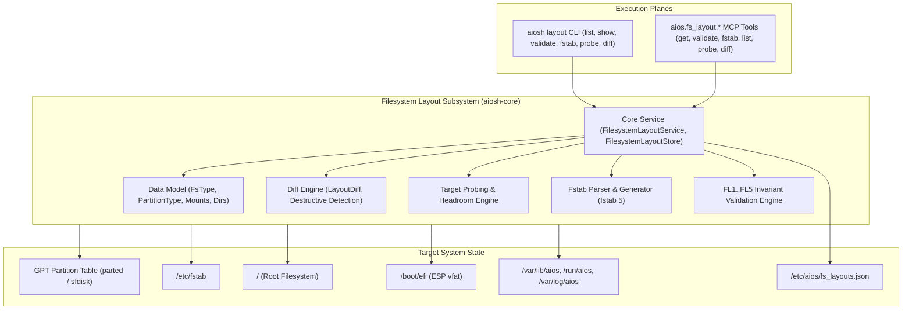

# AIOS Filesystem Layout Subsystem: Architecture & Operational Guide

## 1. Executive Overview & Architectural Role

Phase 1 of AIOS establishes the foundational Linux base operating system and bootable target. The **Filesystem Layout Subsystem** (`aiosh-core::fs_layout` and `aiosh-core::fs_layout_service`) governs the storage partitioning topology, filesystem driver classification, mount hierarchy specifications, `/etc/fstab` configuration, directory permissions, CIS benchmark mount security, target disk feasibility probing, differential comparison, and atomic configuration persistence:

- **Partition Topology**: Governs GPT partition tables, EFI System Partition (ESP), root partitions, swap space, and custom storage slices.
- **Filesystem Hierarchy Standard (FHS 3.0) & UsrMerge**: Canonical directory structures with UsrMerge compatibility symlinks (`/bin -> usr/bin`, `/sbin -> usr/sbin`, `/lib -> usr/lib`).
- **Standard Linux `fstab(5)` Semantics**: Exact 6-field lossless serialization and parsing (`device`, `mount_point`, `fs_type`, `options`, `dump`, `pass`).
- **CIS Benchmark Compliance**: Mandatory security options (`nodev`, `nosuid`, `noexec`) on temporary and shared filesystems (`/tmp`, `/dev/shm`).
- **Target Feasibility Probing**: Computes partition budget allocations against physical or virtual block device capacities and warns on tight storage headroom (< 10% slack).
- **Differential Analysis (`LayoutDiff`)**: Evaluates migration deltas across partitions, mounts, and directories, flagging destructive mutations (partition shrinking, deletions, or filesystem reformatting).
- **Atomic Persistence**: Thread-safe, crash-resilient store persistence with temporary sibling files (`.tmp.<pid>`) and atomic filesystem renaming.
- **AIOS Operational Runtimes**: Standard persistent state in `/var/lib/aios`, volatile IPC sockets in `/run/aios`, configurations in `/etc/aios`, and tamper-evident audit logs in `/var/log/aios`.



---

## 2. Core Service & Data Model

The implementation resides across two modules:
- [`code/aiosh-rust/aiosh-core/src/fs_layout.rs`](file:///c:/Users/OBSESSION/Desktop/AIOS_MERGED/code/aiosh-rust/aiosh-core/src/fs_layout.rs): Data structures, GPT GUID mappings, fstab parser/serializer, and FL1..FL5 validators.
- [`code/aiosh-rust/aiosh-core/src/fs_layout_service.rs`](file:///c:/Users/OBSESSION/Desktop/AIOS_MERGED/code/aiosh-rust/aiosh-core/src/fs_layout_service.rs): Service coordinator, store registry, target disk evaluation, layout diffing, and persistence.

### 2.1 Core Types & Entities

1. **`FilesystemLayoutStore`**:
   - Manages profile registry (`BTreeMap<String, FilesystemLayoutSpec>`).
   - Tracks `active_layout_id: String` (defaults to `aios-uefi-standard-v1`).
   - Methods: `register_layout()`, `get_layout()`, `list_layouts()`, `remove_layout()`, `get_active_layout()`, `set_active_layout()`.
2. **`FilesystemLayoutService`**:
   - `probe_target(layout_id, target_disk_bytes) -> Result<TargetEvaluation, String>`
   - `diff_layouts(source_id, target_id) -> Result<LayoutDiff, String>`
   - `export_fstab(layout_id) -> Result<String, String>`
   - `import_fstab_as_layout(id, name, fstab_content, base_layout_id) -> Result<FilesystemLayoutSpec, String>`
   - `save_to_path(path) -> Result<(), String>`
   - `load_from_path(path) -> Result<Self, String>`
3. **`TargetEvaluation`**:
   - Evaluates block device size against `target_disk_min_bytes` and sum of partition allocations using saturating arithmetic.
   - Emits warnings when free slack headroom is below 10%.
4. **`LayoutDiff`**:
   - Itemized delta across partitions, mounts, and directories.
   - `destructive: bool` dynamically set if partitions are removed or shrunk, or if filesystem types change.

---

## 3. Invariant Systems

### 3.1 Data Model Invariants (`FL1..FL5`)
1. **`FL1` (Single Root Mount)**: Exactly one entry in `mounts` must have `path == "/"`, and its pass number must be `1`. Non-root entries cannot have pass number `1`.
2. **`FL2` (Path Hygiene)**: All paths must be absolute, cannot contain relative traversals (`.` or `..`), double slashes (`//`), control characters, or trailing slashes (except `/`).
3. **`FL3` (Mount Hierarchy Topology)**: No duplicate mount point paths. Ancestor mounts must precede descendant mounts (e.g. `/` before `/boot`, `/boot` before `/boot/efi`).
4. **`FL4` (CIS Security Mount Options)**: Mount points `/tmp` and `/dev/shm` must include `nodev` and `nosuid`.
5. **`FL5` (Partition Constraints)**: Partition indices $1 \le \text{index} \le 128$ and unique; total partition size bounded by target disk capacity; ESP partition must be $\ge 100$ MiB and formatted as `vfat`.

### 3.2 Core Service Invariants (`CS1..CS5`)
1. **`CS1` (Store Integrity)**: Active layout must always point to a registered layout; built-in presets (`standard_uefi`, `minimal_container`) cannot be deleted; active layout cannot be deleted.
2. **`CS2` (Target Geometry Feasibility)**: Target block device must satisfy both layout minimum bytes and partition allocation sum.
3. **`CS3` (Destructive Delta Flagging)**: Any layout diff that shrinks or deletes partitions or alters mount filesystems must flag `destructive = true`.
4. **`CS4` (Fstab Ordering & Import Hygiene)**: Generated fstab must preserve topological depth order; imported fstab files are capped at $\le 128$ entries.
5. **`CS5` (Atomic Persistence)**: Files are written to `.tmp.<pid>` sibling files and renamed atomically; ingestion is bounded to $\le 10$ MiB.

---

## 4. CLI Operator Reference (`aiosh layout`)

Every read subcommand resolves one layout from, in order of precedence: a positional `ID` present in
the store, `--spec <file_or_json>`, `--container` (the `minimal_container` preset), `--standard` (the
`standard_uefi` preset), or — when no selector is given — the store's **active** layout.

### 4.1 List Registered Layouts
```bash
aiosh layout list
aiosh layout list --json
```

### 4.2 Show Layout Specification
```bash
# Show default active layout
aiosh layout show

# Show container layout
aiosh layout show --container --json

# Show custom specification
aiosh layout show --spec /etc/aios/layout.json
```

### 4.3 Validate Layout Specification
```bash
# Validate active layout
aiosh layout validate

# Validate custom file
aiosh layout validate --spec /etc/aios/layout.json --json
```

### 4.4 Probe Target Block Device
```bash
# Probe 100 GiB storage target against active layout
aiosh layout probe --bytes 107374182400

# Probe container target
aiosh layout probe --container --bytes 10737418240 --json
```

### 4.5 Differential Comparison
```bash
# Compare standard UEFI vs container layout
aiosh layout diff aios-uefi-standard-v1 aios-container-minimal-v1
aiosh layout diff aios-uefi-standard-v1 aios-container-minimal-v1 --json
```

### 4.6 Generate `/etc/fstab`
```bash
aiosh layout fstab
aiosh layout fstab --container
```

### 4.7 Register a Custom Layout Profile
```bash
# Register from a JSON spec file
aiosh layout register --spec ./layout.json --store ./layouts.json --json

# Register from inline JSON
aiosh layout register --store ./layouts.json --json \
  --spec '{"id":"lab-vm-v1","name":"Lab VM","description":"Nested virt host","target_disk_min_bytes":34359738368,"partitions":[],"mounts":[{"path":"/","device":"LABEL=AIOS_ROOT","fs_type":"ext4","options":["rw","relatime"],"dump":0,"pass":1,"required":true}],"directories":[],"created_at":"2026-09-17T00:00:00Z"}'
```

`--spec` accepts either the path of an existing regular file or the JSON document itself. The
specification is validated against `FL1..FL5` **before** it enters the store, and duplicate ids are
refused (`REGISTER_FAILED`). Nothing reaches disk unless `--store` is supplied (see §6.7).

### 4.8 Switch the Active Layout
```bash
aiosh layout set-active lab-vm-v1 --store ./layouts.json
```
Both ids are reported (`previous_active` → `active`) and the new pointer is persisted. An unknown id
fails with `SET_ACTIVE_FAILED`.

### 4.9 Remove a Layout Profile
```bash
aiosh layout remove lab-vm-v1 --store ./layouts.json
```
Two refusals, both `REMOVE_FAILED` and both non-destructive: the **currently active** layout cannot be
removed (switch active first), and the canonical presets `aios-uefi-standard-v1` /
`aios-container-minimal-v1` are permanent.

### 4.10 Import an Existing `/etc/fstab`
```bash
# Inherit partitions and directories from the active layout
aiosh layout import-fstab lab-vm-v2 "Lab VM (imported)" --fstab ./fstab.sample --store ./layouts.json

# ...or from a named base profile
aiosh layout import-fstab lab-vm-v2 "Lab VM (imported)" --base aios-uefi-standard-v1 \
  --fstab ./fstab.sample --store ./layouts.json
```

Each usable line is parsed with `fstab(5)` rules (six fields, `#` comments and blanks skipped). At most
128 mount entries are accepted, and content that yields no usable rows is rejected with
`IMPORT_FAILED`. `--fstab` takes either a file path or the fstab content itself.

### 4.11 End-to-End Lifecycle Walkthrough
```bash
STORE="$PWD/layouts.json"

aiosh layout validate --standard                          # canonical preset satisfies FL1..FL5
aiosh layout list --store "$STORE"                        # file absent: in-memory presets are listed
aiosh layout register --spec ./layout.json --store "$STORE"
aiosh layout set-active lab-vm-v1 --store "$STORE"
aiosh layout probe lab-vm-v1 --bytes 214748364800 --store "$STORE"
aiosh layout diff aios-uefi-standard-v1 lab-vm-v1 --store "$STORE"
aiosh layout fstab --store "$STORE" > fstab.generated
aiosh layout remove lab-vm-v1 --store "$STORE"            # refused: it is the active layout
aiosh layout set-active aios-uefi-standard-v1 --store "$STORE"
aiosh layout remove lab-vm-v1 --store "$STORE"            # now accepted
```

### 4.12 Exit Codes & Standard Error Codes

| Exit | Meaning | Codes |
|---|---|---|
| `0` | success | — (the envelope carries `data`) |
| `1` | operational, validation, or I/O failure | `RESOLVE_FAILED`, `VALIDATION_FAILED`, `DIFF_FAILED`, `PROBE_FAILED`, `NOT_VIABLE`, `LOAD_STORE_FAILED`, `SAVE_STORE_FAILED`, `REGISTER_FAILED`, `SET_ACTIVE_FAILED`, `REMOVE_FAILED`, `IMPORT_FAILED`, `SPEC_READ_FAILED`, `SPEC_NOT_REGULAR_FILE`, `SPEC_SIZE_EXCEEDED`, `SPEC_PARSE_FAILED`, `FSTAB_READ_FAILED`, `FSTAB_NOT_REGULAR_FILE`, `FSTAB_SIZE_EXCEEDED` |
| `2` | argument error (the store is never touched) | `ARGUMENT_ERROR`, `INVALID_ARGUMENT`, `UNKNOWN_SUBCOMMAND` |

With `--json`, every invocation prints exactly one envelope —
`{"code": 0|1|2, "data": {...}|null, "error": null|{"code": "...", "message": "..."}}` — so a wrapper
can branch on the exit status and the inner `error.code` without parsing prose. Without `--json`,
results go to stdout and diagnostics to stderr. Every invocation, successful or not, also appends one
hash-chained row to the SQLite audit ring at `$AIOSH_HOME/audit.db`.

---

## 5. MCP Tool Reference (`aios.fs_layout.*`)

### 5.1 `aios.fs_layout.list`
```json
{
  "name": "aios.fs_layout.list",
  "arguments": {}
}
```

### 5.2 `aios.fs_layout.probe`
```json
{
  "name": "aios.fs_layout.probe",
  "arguments": {
    "layout_id": "aios-uefi-standard-v1",
    "target_disk_bytes": 107374182400
  }
}
```

### 5.3 `aios.fs_layout.diff`
```json
{
  "name": "aios.fs_layout.diff",
  "arguments": {
    "source_id": "aios-uefi-standard-v1",
    "target_id": "aios-container-minimal-v1"
  }
}
```

### 5.4 `aios.fs_layout.get`
```json
{
  "name": "aios.fs_layout.get",
  "arguments": {
    "profile": "standard_uefi"
  }
}
```

### 5.5 `aios.fs_layout.validate`
```json
{
  "name": "aios.fs_layout.validate",
  "arguments": {
    "layout": {
      "id": "aios-uefi-standard-v1",
      "name": "Reference Host",
      "description": "Standard layout",
      "target_disk_min_bytes": 68719476736,
      "partitions": [],
      "mounts": [
        {
          "path": "/",
          "device": "LABEL=AIOS_ROOT",
          "fs_type": "ext4",
          "options": ["rw", "relatime"],
          "dump": 0,
          "pass": 1,
          "required": true
        }
      ],
      "directories": [],
      "created_at": "2026-09-16T00:00:00Z"
    }
  }
}
```

### 5.6 `aios.fs_layout.fstab`
```json
{
  "name": "aios.fs_layout.fstab",
  "arguments": {
    "profile": "standard_uefi"
  }
}
```

---

## 6. Constraints & Known Limitations

1. **Declarative Management**: The core service provides control, verification, diffing, and fstab generation in user space. Direct physical disk formatting (`mkfs.*`, `parted`) requires root capabilities and is governed by subsequent disk target execution tasks. The CLI spawns **no external processes**.
2. **Cardinality Caps**: Specifications are bounded to $\le 128$ partitions, $\le 128$ mount points, and $\le 1024$ directories. `/etc/fstab` import additionally accepts at most $\le 128$ mount rows.
3. **Persistence Size Limit**: Layout store JSON files loaded via `load_from_path` or CLI `--spec` are capped at 10 MiB to prevent memory exhaustion attacks.
4. **Built-in Preset Immutability**: Canonical presets `aios-uefi-standard-v1` and `aios-container-minimal-v1` cannot be deleted from the store.
5. **Regular-File Inputs Only**: `--spec`, `--fstab`, and `--store` must name regular files (or, for `--spec`/`--fstab`, hold inline content). A directory, FIFO, or character device is refused by type (`SPEC_NOT_REGULAR_FILE`, `FSTAB_NOT_REGULAR_FILE`, `LOAD_STORE_FAILED`) instead of being read: a FIFO with no writer would block the CLI forever, and `/dev/zero` would stream until memory is exhausted. Symlinks to regular files are still readable; the write path never follows a pre-existing link.
6. **Read Caps Apply During the Read**: The 10 MiB document ceiling is enforced on the byte stream (read `cap + 1` bytes, reject on overflow), not merely from a metadata snapshot that a pseudo-file can under-report.
7. **Mutations Require `--store`**: `register`, `set-active`, `remove`, and `import-fstab` without `--store` operate on a process-local in-memory store seeded with the two canonical presets. They report success, but the change is discarded when the process exits. Always pass `--store <path>` when a change must survive.
8. **Single-Writer Assumption**: There is no cross-process lock on the store file. Two concurrent mutating invocations can lose one update (the last atomic rename wins), so serialize writers that share a store.
9. **Crash Residue and Recovery**: Persistence stages bytes in a sibling `.<name>.tmp.<pid>.<nanos>.<n>` file, flushes it to stable storage, then renames it over the store — so the destination is always either the old or the new *complete* document, never truncated. If the **rename** (not the write) fails, the staged file is deliberately preserved and its path is named in the error; use that file to recover the state that could not be installed. A crash between write and rename can leave one inert staged file beside the store, which is safe to delete. Names are unguessable and created with `O_CREAT | O_EXCL`, and no sweep-by-pattern is offered, because a pattern-based unlink would reintroduce an attacker-influenced deletion primitive.
10. **Windows DOS Device Names**: `Path::new("NUL").exists()` is false on Windows, so `--store NUL` takes the documented "store file missing → canonical presets" path. Nothing is read from or written to the device.
11. **Platform Coverage of the Hardening Proofs**: The FIFO / character-device, read-only-directory, and symlink-at-destination proofs in the CLI hardening suite are POSIX-only and are reported as `SKIP` on Windows. The equivalent core properties (rename-failure preservation, atomic replacement with no residue, non-regular-file rejection with a read-time cap) are asserted on every platform — see [T-01528](file:///c:/Users/OBSESSION/Desktop/AIOS_MERGED/docs/tasks/evidence/T-01528-cli-surface-hardening.md) §3.2.

---

## 7. Task Evidence & Audit Trail

### Sub-Epic 1: Filesystem Layout Data Model (T-01501..T-01510)
- `T-01501`: [Data Model Research](file:///c:/Users/OBSESSION/Desktop/AIOS_MERGED/docs/tasks/evidence/T-01501-data-model-research.md)
- `T-01502`: [Data Model Specification](file:///c:/Users/OBSESSION/Desktop/AIOS_MERGED/docs/tasks/evidence/T-01502-data-model-specification.md)
- `T-01503`: [Data Model Scaffold](file:///c:/Users/OBSESSION/Desktop/AIOS_MERGED/docs/tasks/evidence/T-01503-data-model-scaffold.md)
- `T-01504`: [Data Model Implementation](file:///c:/Users/OBSESSION/Desktop/AIOS_MERGED/docs/tasks/evidence/T-01504-data-model-implementation.md)
- `T-01505`: [Data Model Unit Tests](file:///c:/Users/OBSESSION/Desktop/AIOS_MERGED/docs/tasks/evidence/T-01505-data-model-unit-test.md)
- `T-01506`: [Data Model Integration](file:///c:/Users/OBSESSION/Desktop/AIOS_MERGED/docs/tasks/evidence/T-01506-data-model-integration.md)
- `T-01507`: [Data Model Security Review](file:///c:/Users/OBSESSION/Desktop/AIOS_MERGED/docs/tasks/evidence/T-01507-data-model-security-review.md)
- `T-01508`: [Data Model Hardening](file:///c:/Users/OBSESSION/Desktop/AIOS_MERGED/docs/tasks/evidence/T-01508-data-model-hardening.md)
- `T-01509`: [Data Model Documentation](file:///c:/Users/OBSESSION/Desktop/AIOS_MERGED/docs/tasks/evidence/T-01509-data-model-documentation.md)
- `T-01510`: [Data Model Verification](file:///c:/Users/OBSESSION/Desktop/AIOS_MERGED/docs/tasks/evidence/T-01510-data-model-verification-evidenc.md)

### Sub-Epic 2: Filesystem Layout Core Service (T-01511..T-01520)
- `T-01511`: [Core Service Research](file:///c:/Users/OBSESSION/Desktop/AIOS_MERGED/docs/tasks/evidence/T-01511-core-service-research.md)
- `T-01512`: [Core Service Specification](file:///c:/Users/OBSESSION/Desktop/AIOS_MERGED/docs/tasks/evidence/T-01512-core-service-specification.md)
- `T-01513`: [Core Service Scaffold](file:///c:/Users/OBSESSION/Desktop/AIOS_MERGED/docs/tasks/evidence/T-01513-core-service-scaffold.md)
- `T-01514`: [Core Service Implementation](file:///c:/Users/OBSESSION/Desktop/AIOS_MERGED/docs/tasks/evidence/T-01514-core-service-implementation.md)
- `T-01515`: [Core Service Unit Tests](file:///c:/Users/OBSESSION/Desktop/AIOS_MERGED/docs/tasks/evidence/T-01515-core-service-unit-test.md)
- `T-01516`: [Core Service Integration](file:///c:/Users/OBSESSION/Desktop/AIOS_MERGED/docs/tasks/evidence/T-01516-core-service-integration.md)
- `T-01517`: [Core Service Security Review](file:///c:/Users/OBSESSION/Desktop/AIOS_MERGED/docs/tasks/evidence/T-01517-core-service-security-review.md)
- `T-01518`: [Core Service Hardening](file:///c:/Users/OBSESSION/Desktop/AIOS_MERGED/docs/tasks/evidence/T-01518-core-service-hardening.md)
- `T-01519`: [Core Service Documentation](file:///c:/Users/OBSESSION/Desktop/AIOS_MERGED/docs/tasks/evidence/T-01519-core-service-documentation.md)
- `T-01520`: [Core Service Verification](file:///c:/Users/OBSESSION/Desktop/AIOS_MERGED/docs/tasks/evidence/T-01520-core-service-verification-evidenc.md)

### Sub-Epic 3: Filesystem Layout CLI Surface (T-01521..T-01530)
- `T-01521`: [CLI Surface Research](file:///c:/Users/OBSESSION/Desktop/AIOS_MERGED/docs/tasks/evidence/T-01521-cli-surface-research.md)
- `T-01522`: [CLI Surface Specification](file:///c:/Users/OBSESSION/Desktop/AIOS_MERGED/docs/tasks/evidence/T-01522-cli-surface-specification.md)
- `T-01523`: [CLI Surface Scaffold](file:///c:/Users/OBSESSION/Desktop/AIOS_MERGED/docs/tasks/evidence/T-01523-cli-surface-scaffold.md)
- `T-01524`: [CLI Surface Implementation](file:///c:/Users/OBSESSION/Desktop/AIOS_MERGED/docs/tasks/evidence/T-01524-cli-surface-implementation.md)
- `T-01525`: [CLI Surface Unit Tests](file:///c:/Users/OBSESSION/Desktop/AIOS_MERGED/docs/tasks/evidence/T-01525-cli-surface-unit-test.md)
- `T-01526`: [CLI Surface Integration](file:///c:/Users/OBSESSION/Desktop/AIOS_MERGED/docs/tasks/evidence/T-01526-cli-surface-integration.md)
- `T-01527`: [CLI Surface Security Review](file:///c:/Users/OBSESSION/Desktop/AIOS_MERGED/docs/tasks/evidence/T-01527-cli-surface-security-review.md)
- `T-01528`: [CLI Surface Hardening](file:///c:/Users/OBSESSION/Desktop/AIOS_MERGED/docs/tasks/evidence/T-01528-cli-surface-hardening.md)
- `T-01529`: [CLI Surface Documentation](file:///c:/Users/OBSESSION/Desktop/AIOS_MERGED/docs/tasks/evidence/T-01529-cli-surface-documentation.md)
- `T-01530`: [CLI Surface Verification](file:///c:/Users/OBSESSION/Desktop/AIOS_MERGED/docs/tasks/evidence/T-01530-cli-surface-verification-evidenc.md)
