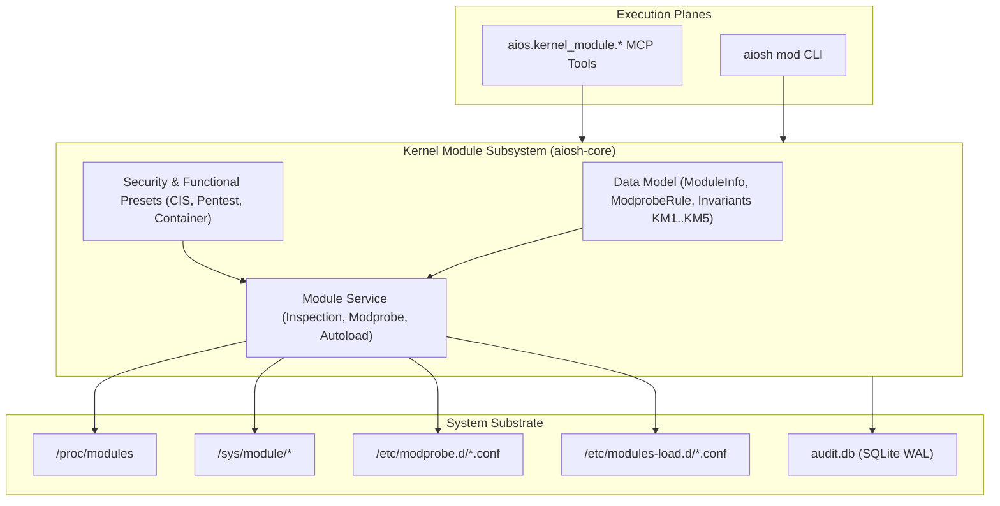

# AIOS Kernel Module Management Subsystem: Architecture & Operational Guide

## 1. Executive Overview & Architectural Role
Phase 1 of AIOS establishes the foundational Linux base operating system and bootable target. The **Kernel Module Management Subsystem** (`aiosh-core::kernel_module`) governs the inspection, configuration, security hardening, and autoloading of Linux kernel modules across the system:

- **Runtime Module Introspection**: Parsing `/proc/modules` and sysfs (`/sys/module/<name>`) to inspect loaded modules, memory footprint, hold counts, dependency trees, and runtime states (`live`, `loading`, `unloading`).
- **Declarative `modprobe.d(5)` Governance**: Strongly-typed abstractions for `blacklist`, `alias`, `options`, `install`, `remove`, and `softdep` configuration directives.
- **CIS Benchmark Security Hardening**: Built-in enforcement profiles disabling legacy filesystems (`cramfs`, `freevxfs`, `jffs2`, `hfs`, `hfsplus`, `udf`) and obsolete/vulnerable network protocols (`dccp`, `sctp`, `rds`, `tipc`) via `install <module> /bin/true`.
- **Penetration Testing Driver Baselines**: Canonical module profiles for ethical hacking hardware, wireless injection drivers (`mac80211`, `cfg80211`, `ath9k_htc`, `rtl8812au`), and monitor mode operations.
- **Container & Sandbox Isolation**: Automated dependency management for containerization and networking namespaces (`overlay`, `tun`, `tap`, `br_netfilter`, `nf_tables`).

---

## 2. Core Data Model & Types
The kernel module data model is defined in `code/aiosh-rust/aiosh-core/src/kernel_module.rs`:

### `ModuleInfo`
| Field | Type | Description | Invariants Enforced |
|---|---|---|---|
| `name` | `String` | Canonical module name (`^[a-zA-Z0-9_]{1,64}$`) | `KM1`, length $[1 \dots 64]$ |
| `size_bytes` | `u64` | In-memory module size in bytes | $> 0$ for active modules |
| `ref_count` | `u32` | Number of references / dependents holding the module | $\ge 0$ |
| `used_by` | `Vec<String>` | List of dependent modules | Valid module identifiers |
| `state` | `ModuleState` | Operational state (`Live`, `Loading`, `Unloading`, `Unloaded`) | Valid lifecycle state |
| `parameters` | `Vec<ModuleParameter>` | Configurable module parameters | `KM2`, parameter safety |
| `description` | `Option<String>` | Module description from `modinfo` | Bounded text |
| `license` | `Option<String>` | Module license string (e.g. `GPL`, `Dual BSD/GPL`) | Bounded text |
| `version` | `Option<String>` | Driver version string | Bounded text |
| `srcversion` | `Option<String>` | Source code checksum | Bounded text |
| `vermagic` | `Option<String>` | Kernel version magic string | Bounded text |
| `signature` | `Option<String>` | Cryptographic signature verification | Bounded text |
| `taint_flags` | `Option<String>` | Kernel taint indicators (`P`, `O`, `E`, etc.) | Bounded text |

### `ModprobeRule`
Represents standard directives in `modprobe.d(5)`:
- `Blacklist { module: String }`: Prevents module from being loaded via normal autoloading.
- `Alias { alias: String, module: String }`: Maps alternative or wildcard names to a target module.
- `Options { module: String, options: Vec<String> }`: Supplies static parameters to module on initialization.
- `Install { module: String, command: String }`: Executes custom command on install (e.g. `/bin/true` to disable).
- `Remove { module: String, command: String }`: Executes custom command on module removal.
- `Softdep { module: String, pre: Vec<String>, post: Vec<String> }`: Declares optional pre- and post-load dependencies.

### Invariants (KM1..KM5)
- **KM1: Module Name Syntax**: Module names must consist strictly of ASCII alphanumeric characters and underscores (`^[a-zA-Z0-9_]{1,64}$`). Slashes, dots, dashes, and shell metacharacters are strictly rejected.
- **KM2: Parameter Safety & Bounds**: Parameter keys must be valid identifiers; values must be non-control ASCII within 1024 bytes and must reject shell injection characters (`;`, `&`, `|`, `` ` ``, `$`, `\n`).
- **KM3: Conflict Prevention**: Autoloaded modules declared in `/etc/modules-load.d/` cannot be simultaneously blacklisted or disabled via `install <module> /bin/true` in `modprobe.d`.
- **KM4: CIS Hardened Baseline**: Built-in hardening preset specifies complete disablement (`install ... /bin/true` and `blacklist`) for legacy filesystems (`cramfs`, `freevxfs`, `jffs2`, `hfs`, `hfsplus`, `udf`) and obsolete protocols (`dccp`, `sctp`, `rds`, `tipc`).
- **KM5: Deterministic Roundtrip**: Structured `KernelModuleConfig` roundtrips losslessly to canonical JSON and standard Linux `modprobe.d` configuration syntax.

---

## 3. Canonical Presets
The data model provides three built-in canonical presets:

1. **`cis_hardened_baseline`**:
   - Implements CIS Distribution Hardening rules.
   - Disables `cramfs`, `freevxfs`, `jffs2`, `hfs`, `hfsplus`, `udf`, `dccp`, `sctp`, `rds`, and `tipc`.
2. **`pentest_wireless_baseline`**:
   - Configures driver parameters for wireless penetration testing (`ath9k_htc nohwcrypt=1`, `rtl8812au rtw_vht_enable=1`).
   - Autoloads `cfg80211` and `mac80211`.
3. **`container_isolation_baseline`**:
   - Configures overlay filesystem parameters (`overlay metacopy=on`).
   - Autoloads `overlay`, `tun`, `br_netfilter`, and `nf_tables`.

---

## 4. Sub-Epic 1: Kernel Module Management Data Model (T-01601..T-01610)

This sub-epic establishes and verifies the core data structures, validation rules, and configuration parsers for kernel modules:
- **Invariants Verified**: KM1 through KM5.
- **Unit Tests**: `cargo test -p aiosh-core --lib kernel_module` (6/6 passing).
- **Integration Tests**: `cargo test -p aiosh-core --test test_kernel_module_data_model` (6/6 passing).

**Evidence Links:**
- `T-01601`: [Data Model Research](file:///c:/Users/OBSESSION/Desktop/AIOS_MERGED/docs/tasks/evidence/T-01601-kernel-module-data-model-research.md)
- `T-01602`: [Data Model Specification](file:///c:/Users/OBSESSION/Desktop/AIOS_MERGED/docs/tasks/evidence/T-01602-kernel-module-data-model-specification.md)
- `T-01603`: [Data Model Scaffold](file:///c:/Users/OBSESSION/Desktop/AIOS_MERGED/docs/tasks/evidence/T-01603-kernel-module-data-model-scaffold.md)
- `T-01604`: [Data Model Implementation](file:///c:/Users/OBSESSION/Desktop/AIOS_MERGED/docs/tasks/evidence/T-01604-kernel-module-data-model-implementation.md)
- `T-01605`: [Data Model Unit Test](file:///c:/Users/OBSESSION/Desktop/AIOS_MERGED/docs/tasks/evidence/T-01605-kernel-module-data-model-unit-test.md)
- `T-01606`: [Data Model Integration](file:///c:/Users/OBSESSION/Desktop/AIOS_MERGED/docs/tasks/evidence/T-01606-kernel-module-data-model-integration.md)
- `T-01607`: [Data Model Security Review](file:///c:/Users/OBSESSION/Desktop/AIOS_MERGED/docs/tasks/evidence/T-01607-kernel-module-data-model-security-review.md)
- `T-01608`: [Data Model Hardening](file:///c:/Users/OBSESSION/Desktop/AIOS_MERGED/docs/tasks/evidence/T-01608-kernel-module-data-model-hardening.md)
- `T-01609`: [Data Model Documentation](file:///c:/Users/OBSESSION/Desktop/AIOS_MERGED/docs/tasks/evidence/T-01609-kernel-module-data-model-documentation.md)
- `T-01610`: [Data Model Verification & Evidence](file:///c:/Users/OBSESSION/Desktop/AIOS_MERGED/docs/tasks/evidence/T-01610-kernel-module-data-model-verification-evidenc.md)
