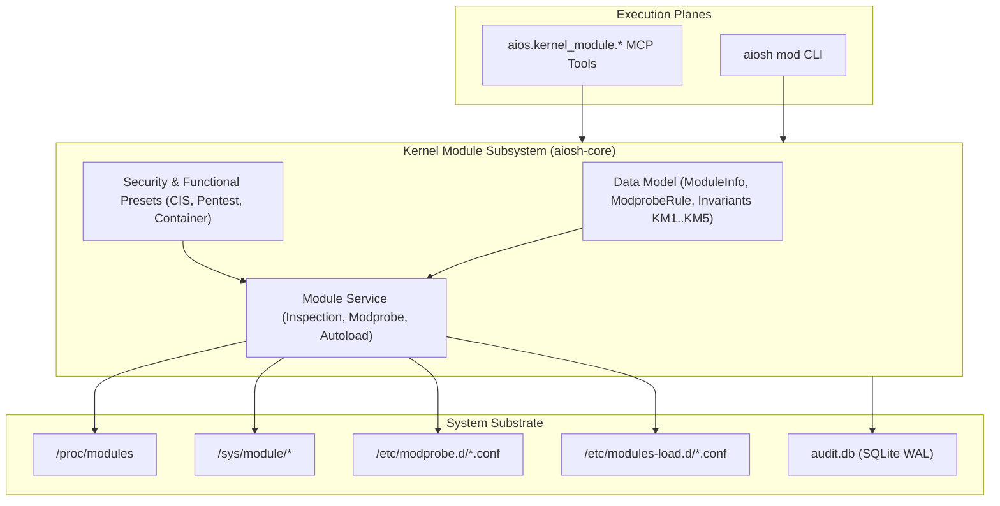

# AIOS Kernel Module Management Subsystem: Architecture & Operational Guide

## 1. Executive Overview & Architectural Role
Phase 1 of AIOS establishes the foundational Linux base operating system and bootable target. The **Kernel Module Management Subsystem** (`aiosh-core::kernel_module`) governs the inspection, configuration, security hardening, and autoloading of Linux kernel modules across the system:

- **Runtime Module Introspection**: Parsing `/proc/modules` and sysfs (`/sys/module/<name>`) to inspect loaded modules, memory footprint, hold counts, dependency trees, and runtime states (`live`, `loading`, `unloading`).
- **Declarative `modprobe.d(5)` Governance**: Strongly-typed abstractions for `blacklist`, `alias`, `options`, `install`, `remove`, and `softdep` configuration directives.
- **CIS Benchmark Security Hardening**: Built-in enforcement profiles disabling legacy filesystems (`cramfs`, `freevxfs`, `jffs2`, `hfs`, `hfsplus`, `udf`) and obsolete/vulnerable network protocols (`dccp`, `sctp`, `rds`, `tipc`) via `install <module> /bin/true`.
- **Penetration Testing Driver Baselines**: Canonical module profiles for ethical hacking hardware, wireless injection drivers (`mac80211`, `cfg80211`, `ath9k_htc`, `rtl8812au`), and monitor mode operations.
- **Container & Sandbox Isolation**: Automated dependency management for containerization and networking namespaces (`overlay`, `tun`, `tap`, `br_netfilter`, `nf_tables`).



---

## 2. Core Data Model & Types
The kernel module data model is defined in `code/aiosh-rust/aiosh-core/src/kernel_module.rs`:

### `ModuleInfo`
| Field | Type | Description | Invariants Enforced |
|---|---|---|---|
| `name` | `String` | Canonical module name (`^[a-zA-Z0-9_]{1,64}$`) | `KM1`, length $[1 \dots 64]$ |
| `size_bytes` | `u64` | In-memory module size in bytes | $> 0$ for active modules |
| `ref_count` | `u32` | Number of references / dependents holding the module | $\ge 0$ |
| `used_by` | `Vec<String>` | List of dependent modules | Valid module identifiers |
| `state` | `ModuleState` | Operational state (`Live`, `Loading`, `Unloading`, `Unloaded`) | Valid lifecycle state |
| `parameters` | `Vec<ModuleParameter>` | Configurable module parameters | `KM2`, parameter safety |
| `description` | `Option<String>` | Module description from `modinfo` | Bounded text |
| `license` | `Option<String>` | Module license string (e.g. `GPL`, `Dual BSD/GPL`) | Bounded text |
| `version` | `Option<String>` | Driver version string | Bounded text |
| `srcversion` | `Option<String>` | Source code checksum | Bounded text |
| `vermagic` | `Option<String>` | Kernel version magic string | Bounded text |
| `signature` | `Option<String>` | Cryptographic signature verification | Bounded text |
| `taint_flags` | `Option<String>` | Kernel taint indicators (`P`, `O`, `E`, etc.) | Bounded text |

### `ModprobeRule`
Represents standard directives in `modprobe.d(5)`:
- `Blacklist { module: String }`: Prevents module from being loaded via normal autoloading.
- `Alias { alias: String, module: String }`: Maps alternative or wildcard names to a target module.
- `Options { module: String, options: Vec<String> }`: Supplies static parameters to module on initialization.
- `Install { module: String, command: String }`: Executes custom command on install (e.g. `/bin/true` to disable).
- `Remove { module: String, command: String }`: Executes custom command on module removal.
- `Softdep { module: String, pre: Vec<String>, post: Vec<String> }`: Declares optional pre- and post-load dependencies.

### Invariants (KM1..KM5)
- **KM1: Module Name Syntax**: Module names must consist strictly of ASCII alphanumeric characters and underscores (`^[a-zA-Z0-9_]{1,64}$`). Slashes, dots, dashes, and shell metacharacters are strictly rejected.
- **KM2: Parameter Safety & Bounds**: Parameter keys must be valid identifiers; values must be non-control ASCII within 1024 bytes and must reject shell injection characters (`;`, `&`, `|`, `` ` ``, `$`, `\n`).
- **KM3: Conflict Prevention**: Autoloaded modules declared in `/etc/modules-load.d/` cannot be simultaneously blacklisted or disabled via `install <module> /bin/true` in `modprobe.d`.
- **KM4: CIS Hardened Baseline**: Built-in hardening preset specifies complete disablement (`install ... /bin/true` and `blacklist`) for legacy filesystems (`cramfs`, `freevxfs`, `jffs2`, `hfs`, `hfsplus`, `udf`) and obsolete protocols (`dccp`, `sctp`, `rds`, `tipc`).
- **KM5: Deterministic Roundtrip**: Structured `KernelModuleConfig` roundtrips losslessly to canonical JSON and standard Linux `modprobe.d` configuration syntax.

---

## 3. Canonical Presets
The data model provides three built-in canonical presets:

1. **`cis_hardened_baseline`**:
   - Implements CIS Distribution Hardening rules.
   - Disables `cramfs`, `freevxfs`, `jffs2`, `hfs`, `hfsplus`, `udf`, `dccp`, `sctp`, `rds`, and `tipc`.
2. **`pentest_wireless_baseline`**:
   - Configures driver parameters for wireless penetration testing (`ath9k_htc nohwcrypt=1`, `rtl8812au rtw_vht_enable=1`).
   - Autoloads `cfg80211` and `mac80211`.
3. **`container_isolation_baseline`**:
   - Configures overlay filesystem parameters (`overlay metacopy=on`).
   - Autoloads `overlay`, `tun`, `br_netfilter`, and `nf_tables`.

---

## 4. Sub-Epic 1: Kernel Module Management Data Model (T-01601..T-01610)

This sub-epic establishes and verifies the core data structures, validation rules, and configuration parsers for kernel modules:
- **Invariants Verified**: KM1 through KM5.
- **Unit Tests**: `cargo test -p aiosh-core --lib kernel_module` (6/6 passing).
- **Integration Tests**: `cargo test -p aiosh-core --test test_kernel_module_data_model` (6/6 passing).

**Evidence Links:**
- `T-01601`: [Data Model Research](file:///c:/Users/OBSESSION/Desktop/AIOS_MERGED/docs/tasks/evidence/T-01601-kernel-module-data-model-research.md)
- `T-01602`: [Data Model Specification](file:///c:/Users/OBSESSION/Desktop/AIOS_MERGED/docs/tasks/evidence/T-01602-kernel-module-data-model-specification.md)
- `T-01603`: [Data Model Scaffold](file:///c:/Users/OBSESSION/Desktop/AIOS_MERGED/docs/tasks/evidence/T-01603-kernel-module-data-model-scaffold.md)
- `T-01604`: [Data Model Implementation](file:///c:/Users/OBSESSION/Desktop/AIOS_MERGED/docs/tasks/evidence/T-01604-kernel-module-data-model-implementation.md)
- `T-01605`: [Data Model Unit Test](file:///c:/Users/OBSESSION/Desktop/AIOS_MERGED/docs/tasks/evidence/T-01605-kernel-module-data-model-unit-test.md)
- `T-01606`: [Data Model Integration](file:///c:/Users/OBSESSION/Desktop/AIOS_MERGED/docs/tasks/evidence/T-01606-kernel-module-data-model-integration.md)
- `T-01607`: [Data Model Security Review](file:///c:/Users/OBSESSION/Desktop/AIOS_MERGED/docs/tasks/evidence/T-01607-kernel-module-data-model-security-review.md)
- `T-01608`: [Data Model Hardening](file:///c:/Users/OBSESSION/Desktop/AIOS_MERGED/docs/tasks/evidence/T-01608-kernel-module-data-model-hardening.md)
- `T-01609`: [Data Model Documentation](file:///c:/Users/OBSESSION/Desktop/AIOS_MERGED/docs/tasks/evidence/T-01609-kernel-module-data-model-documentation.md)
- `T-01610`: [Data Model Verification & Evidence](file:///c:/Users/OBSESSION/Desktop/AIOS_MERGED/docs/tasks/evidence/T-01610-kernel-module-data-model-verification-evidenc.md)

---

## 5. Sub-Epic 2: Kernel Module Management Core Service (T-01611..T-01620)

This sub-epic establishes and verifies the runtime coordinator (`KernelModuleService`) and persistent store (`KernelModuleStore`):
- **Core Service Invariants (KS1..KS5)**:
  - **KS1: Graceful Procfs Fallback**: Missing `/proc/modules` returns an empty list without error, ensuring stability across non-Linux hosts, chroots, and unprivileged container environments.
  - **KS2: Pre-Commit Conflict Prevention**: Service rejects mutations attempting to blacklist an autoloaded module, or autoload a blacklisted/disabled module.
  - **KS3: Atomic Persistence & Leak-Free Rollback**: Sibling staging files (`.tmp.<pid>.<filename>`) guarantee atomic replacement via `rename(2)` and clean up temporary files on error.
  - **KS4: Idempotent Rule Management**: Duplicate blacklist entries are deduplicated, and parameter options are updated in-place without duplicating lines.
  - **KS5: Bounded Document Size**: Strict 10 MiB ceiling (`MAX_MODULE_DOC_BYTES`) enforced symmetrically on store reads and writes.

**Unit & Integration Testing**:
- Unit tests: `cargo test -p aiosh-core --lib kernel_module_service` (6/6 passing).
- Integration tests: `cargo test -p aiosh-core --test test_kernel_module_service` (6/6 passing).

**Evidence Links:**
- `T-01611`: [Core Service Research](file:///c:/Users/OBSESSION/Desktop/AIOS_MERGED/docs/tasks/evidence/T-01611-kernel-module-core-service-research.md)
- `T-01612`: [Core Service Specification](file:///c:/Users/OBSESSION/Desktop/AIOS_MERGED/docs/tasks/evidence/T-01612-kernel-module-core-service-specification.md)
- `T-01613`: [Core Service Scaffold](file:///c:/Users/OBSESSION/Desktop/AIOS_MERGED/docs/tasks/evidence/T-01613-kernel-module-core-service-scaffold.md)
- `T-01614`: [Core Service Implementation](file:///c:/Users/OBSESSION/Desktop/AIOS_MERGED/docs/tasks/evidence/T-01614-kernel-module-core-service-implementation.md)
- `T-01615`: [Core Service Unit Test](file:///c:/Users/OBSESSION/Desktop/AIOS_MERGED/docs/tasks/evidence/T-01615-kernel-module-core-service-unit-test.md)
- `T-01616`: [Core Service Integration](file:///c:/Users/OBSESSION/Desktop/AIOS_MERGED/docs/tasks/evidence/T-01616-kernel-module-core-service-integration.md)
- `T-01617`: [Core Service Security Review](file:///c:/Users/OBSESSION/Desktop/AIOS_MERGED/docs/tasks/evidence/T-01617-kernel-module-core-service-security-review.md)
- `T-01618`: [Core Service Hardening](file:///c:/Users/OBSESSION/Desktop/AIOS_MERGED/docs/tasks/evidence/T-01618-kernel-module-core-service-hardening.md)
- `T-01619`: [Core Service Documentation](file:///c:/Users/OBSESSION/Desktop/AIOS_MERGED/docs/tasks/evidence/T-01619-kernel-module-core-service-documentation.md)
- `T-01620`: [Core Service Verification & Evidence](file:///c:/Users/OBSESSION/Desktop/AIOS_MERGED/docs/tasks/evidence/T-01620-kernel-module-core-service-verification-evidenc.md)

## 6. Sub-Epic 3: Kernel Module Management CLI Surface (T-01621..T-01630)

The operator surface is exposed via `aiosh mod` (alias: `aiosh module`) in `code/aiosh-rust/aiosh-cli/src/main.rs`.

### 6.1 Subcommands & Syntax
- `aiosh mod list [--store <path>] [--proc-modules <path>] [--json]`: Lists live kernel modules and configured store rules.
- `aiosh mod show <name> [--store <path>] [--proc-modules <path>] [--json]`: Displays status, parameters, dependencies, and configuration directives for a specific module.
- `aiosh mod blacklist <module> [--store <path>] [--json]`: Adds module to blacklist in the store. Rejects autoloaded modules.
- `aiosh mod unblacklist <module> [--store <path>] [--json]`: Removes module from store blacklist rules.
- `aiosh mod options <module> <k=v...> [--store <path>] [--json]`: Configures module parameters.
- `aiosh mod autoload <module> [--store <path>] [--json]`: Configures module for boot autoload (`/etc/modules-load.d/`). Rejects blacklisted modules.
- `aiosh mod unautoload <module> [--store <path>] [--json]`: Removes module from autoload list.
- `aiosh mod preset list [--json]`: Enumerates canonical presets (`cis_hardened_baseline`, `pentest_wireless_baseline`, `container_isolation_baseline`).
- `aiosh mod preset apply <name> [--store <path>] [--json]`: Applies preset rules and autoloads into active store.
- `aiosh mod export [--store <path>] [--modprobe <path>] [--autoload <path>] [--json]`: Exports `modprobe.d` and `modules-load.d` configuration directives.

### 6.2 Exit Codes
- `0`: Success.
- `1`: Domain validation or conflict error (e.g., `MODULE_NOT_FOUND`, `BLACKLIST_FAILED`, `AUTOLOAD_FAILED`, `OPTIONS_FAILED`, `PRESET_APPLY_FAILED`).
- `2`: Invocation error (missing arguments, unknown subcommand, path > 1024 chars, control characters).

### 6.3 Invariants (KC1..KC5)
- **KC1: CLI Invariant & Validation**: Strict argument counting and type checks; exits 2 on syntax errors.
- **KC2: JSON Envelope Uniformity**: Structured response `{ "code": <int>, "data": <T>, "error": <err_obj_or_null> }` when `--json` is supplied.
- **KC3: Terminal Output Sanitization**: Non-JSON terminal output sanitized using `sanitize_terminal` to strip escape sequences (CWE-150).
- **KC4: Structured Audit Logging**: Every command execution path (success and error) emits an audit row via `classify_and_emit()`.
- **KC5: Fail-Closed Error Handling**: Specific error codes and safe defaults without unhandled panics.

### 6.4 Verification Evidence
- In-tree unit tests: `cargo test -p aiosh-cli --bin aiosh test_cmd_kernel_module_flow` (100% pass rate).
- Integration smoke tests: `code/aiosh-cli/tests/test_kernel_module_cli_smoke.py` (100% pass rate).

---

## 7. Agent MCP API Surface (`aios.kernel_module.*`)

The MCP (Model Context Protocol) API surface enables AI agents to query, configure, and manage Linux kernel modules programmatically over JSON-RPC stdio.

### 7.1 Tools & JSON-RPC Schemas

1. `aios.kernel_module.list`:
   - **Arguments**: `store_path` (optional string), `proc_modules_path` (optional string).
   - **Returns**: `ok: bool`, `data: { loaded_modules: [...], rules: [...], autoload_modules: [...] }`.
2. `aios.kernel_module.get`:
   - **Arguments**: `module` (string, required), `store_path` (optional string), `proc_modules_path` (optional string).
   - **Returns**: `ok: bool`, `data: { module: ModuleInfo }`.
3. `aios.kernel_module.blacklist`:
   - **Arguments**: `module` (string, required), `store_path` (optional string), `grant_id` (optional string).
   - **Returns**: `ok: bool`, `data: { module: string, action: "blacklisted" }`.
4. `aios.kernel_module.unblacklist`:
   - **Arguments**: `module` (string, required), `store_path` (optional string), `grant_id` (optional string).
   - **Returns**: `ok: bool`, `data: { module: string, action: "unblacklisted" }`.
5. `aios.kernel_module.options`:
   - **Arguments**: `module` (string, required), `options` (array of strings, required), `store_path` (optional string), `grant_id` (optional string).
   - **Returns**: `ok: bool`, `data: { module: string, options: [...] }`.
6. `aios.kernel_module.autoload`:
   - **Arguments**: `module` (string, required), `store_path` (optional string), `grant_id` (optional string).
   - **Returns**: `ok: bool`, `data: { module: string, action: "autoload_added" }`.
7. `aios.kernel_module.unautoload`:
   - **Arguments**: `module` (string, required), `store_path` (optional string), `grant_id` (optional string).
   - **Returns**: `ok: bool`, `data: { module: string, action: "autoload_removed" }`.
8. `aios.kernel_module.preset.list`:
   - **Arguments**: None.
   - **Returns**: `ok: bool`, `data: [ { name: string, description: string, ... } ]`.
9. `aios.kernel_module.preset.apply`:
   - **Arguments**: `preset_name` (string, required), `store_path` (optional string), `grant_id` (optional string).
   - **Returns**: `ok: bool`, `data: { preset: string, action: "applied" }`.
10. `aios.kernel_module.export`:
    - **Arguments**: `store_path` (optional string).
    - **Returns**: `ok: bool`, `data: { modprobe_conf: string, modules_load_conf: string }`.

### 7.2 Example Tool Invocation

```json
{
  "jsonrpc": "2.0",
  "id": 1,
  "method": "tools/call",
  "params": {
    "name": "aios.kernel_module.blacklist",
    "arguments": {
      "module": "usb_storage",
      "store_path": "/etc/aios/kernel_modules.json"
    }
  }
}
```

**Response**:
```json
{
  "jsonrpc": "2.0",
  "id": 1,
  "result": {
    "content": [
      {
        "type": "text",
        "text": "{\"ok\":true,\"data\":{\"action\":\"blacklisted\",\"module\":\"usb_storage\"}}"
      }
    ]
  }
}
```

### 7.3 Security Invariants (KM-M1..KM-M5)
- **KM-M1: Schema Strictness**: All tools declare explicit input schemas with `additionalProperties: false` and bounded string lengths (`maxLength: 1024` for paths, `maxLength: 64` for module names).
- **KM-M2: Path Sanitization**: Rejects paths with ASCII control characters (`\x00`..`\x1F`, `\x7F`) or length > 1024 characters.
- **KM-M3: Pre-Commit Conflict Prevention**: Rejects blacklisting autoloaded modules or autoloading blacklisted modules with descriptive errors.
- **KM-M4: Atomic Serialization**: Saves state via temporary sibling files and atomic rename to prevent partial writes.
- **KM-M5: Capability Gating & Audit Logging**: Accepts optional `grant_id` for PEP authorization tracking and emits audit events.

### 7.4 Verification Evidence
- In-tree Rust unit test: `cargo test -p aiosh-mcp --bin aiosh-mcp test_mcp_kernel_module_tools` (`docs/tasks/evidence/T-01635-mcp-api-surface-unit-test.md`).
- Integration smoke test: `python code/aiosh-mcp/tests/test_kernel_module_mcp_smoke.py` (`docs/tasks/evidence/T-01636-mcp-api-surface-integration.md`).
- Security Review: `docs/tasks/evidence/T-01637-mcp-api-surface-security-review.md`.
- Hardening: `docs/tasks/evidence/T-01638-mcp-api-surface-hardening.md`.

---

## 8. Configuration Subsystem

The Configuration Subsystem manages bidirectional synchronization between the canonical AIOS JSON store (`KernelModuleStore`) and host Linux configuration files (`/etc/modprobe.d/` and `/etc/modules-load.d/`).

### 8.1 Configuration Invariants (CFG-KM1..CFG-KM5)
- **CFG-KM1: Path Validity & Presence**: Default store path and export paths must be non-empty and well-formed.
- **CFG-KM2: Path Bounds & Sanitization**: Paths must not exceed 1024 bytes and must not contain ASCII control characters (`\x00`..`\x1F`, `\x7F`).
- **CFG-KM3: Pre-Commit Conflict Prevention**: An autoloaded module cannot be simultaneously blacklisted or disabled via install directive. Importing conflicting files is rejected before writing.
- **CFG-KM4: Document Size Ceilings**: Stores and import buffers are capped at `MAX_MODULE_DOC_BYTES` (10 MiB) to prevent memory exhaustion.
- **CFG-KM5: Roundtrip Fidelity**: Exporting configuration directives and re-importing into a fresh store preserves exact semantic equivalence.

### 8.2 Ingesting & Exporting Configurations

#### CLI Ingestion
```bash
aiosh mod import --store /etc/aios/kernel_modules.json \
                 --modprobe /etc/modprobe.d/custom.conf \
                 --autoload /etc/modules-load.d/custom.conf \
                 --json
```

**JSON Response**:
```json
{
  "code": 0,
  "data": {
    "modprobe_imported": 2,
    "autoload_imported": 2
  },
  "error": null
}
```

#### CLI Export
```bash
aiosh mod export --store /etc/aios/kernel_modules.json \
                 --modprobe /etc/modprobe.d/aios.conf \
                 --autoload /etc/modules-load.d/aios.conf \
                 --json
```

### 8.3 Constraints & Known Limitations
1. Module names must consist only of ASCII alphanumeric characters and underscores (`^[a-zA-Z0-9_]+$`). Hyphens in module names must be converted to underscores per Linux kernel conventions.
2. Ingesting directives that violate mutual exclusion (e.g. blacklisting an already autoloaded module) will fail with exit code 1 (`IMPORT_MODPROBE_FAILED` or `IMPORT_AUTOLOAD_FAILED`).
3. Comments (`#` and `;`) are ignored during file ingestion and not preserved in the canonical JSON store.

### 8.4 Verification Evidence
- Research: `docs/tasks/evidence/T-01641-configuration-research.md`.
- Specification: `docs/tasks/evidence/T-01642-configuration-specification.md`.
- Scaffold: `docs/tasks/evidence/T-01643-configuration-scaffold.md`.
- Implementation: `docs/tasks/evidence/T-01644-configuration-implementation.md`.
- Unit Test: `docs/tasks/evidence/T-01645-configuration-unit-test.md`.
- Integration: `docs/tasks/evidence/T-01646-configuration-integration.md`.
- Security Review: `docs/tasks/evidence/T-01647-configuration-security-review.md`.
- Hardening: `docs/tasks/evidence/T-01648-configuration-hardening.md`.

---

## 9. Automated Testing & Verification Batteries

The Kernel Module Management subsystem includes an 8-stage automated test battery orchestrated by `tools/test_kernel_module_suites.py`.

### 9.1 Test Batteries Overview

| Battery | Target Suite | Scope |
|---|---|---|
| **KM1** | `test_kernel_module_data_model.rs` | Invariants KM1..KM5: module syntax, parameter validation, install command safety, preset completeness. |
| **KM2** | `test_kernel_module_service.rs` | Runtime service: procfs fallback, pre-commit conflict detection, atomic persistence, idempotent mutations. |
| **KM3** | `test_kernel_module_config.rs` | Subsystem configuration: modprobe.d and modules-load.d line parsers, store ingestion, CFG-KM1..CFG-KM5. |
| **KM4** | `test_kernel_module_automated.rs` | In-tree integration: compound state transitions, scale limits (1000 rules, 200 autoloads), 10 MiB document ceiling, corrupt store recovery. |
| **KM5** | `test_kernel_module_cli_smoke.py` | Operator CLI: subcommands (`list`, `show`, `blacklist`, `unblacklist`, `options`, `autoload`, `unautoload`, `preset`, `export`), exit codes, terminal sanitization. |
| **KM6** | `test_kernel_module_mcp_smoke.py` | Agent MCP: JSON-RPC tools (`aios.kernel_module.*`), schema advertising, full lifecycle, cross-surface parity. |
| **KM7** | `test_kernel_module_config_smoke.py` | Configuration integration: `aiosh mod import` and `export`, roundtrip fidelity, conflict rejection. |
| **KM8** | `test_kernel_module_automated_cases.py` | Compound lifecycle sequences, boundary values (64-char module names, 1024-byte parameters), concurrent store isolation. |

### 9.2 Running the Test Orchestrator

```bash
# Execute all 8 test batteries in sequence
python tools/test_kernel_module_suites.py
```

### 9.3 Invariants (AT-KM1..AT-KM5)
- **AT-KM1: Compound State Transitions**: End-to-end multi-step flows preserve state integrity and disk consistency.
- **AT-KM2: Scale & Density Limits**: System gracefully handles 1,000 rules and 200 autoload modules without performance degradation.
- **AT-KM3: Document Ceiling**: Stores exceeding `MAX_MODULE_DOC_BYTES` (10 MiB) fail with explicit errors.
- **AT-KM4: Corruption Resilience**: Malformed or truncated store files produce structured error envelopes without corrupting files.
- **AT-KM5: Cross-Surface Parity**: Identical underlying state is observed and mutated across CLI, MCP, and configuration surfaces.

### 9.4 Verification Evidence
- Research: `docs/tasks/evidence/T-01651-automated-tests-research.md`.
- Specification: `docs/tasks/evidence/T-01652-automated-tests-specification.md`.
- Scaffold: `docs/tasks/evidence/T-01653-automated-tests-scaffold.md`.
- Implementation: `docs/tasks/evidence/T-01654-automated-tests-implementation.md`.
- Unit Test: `docs/tasks/evidence/T-01655-automated-tests-unit-test.md`.
- Integration: `docs/tasks/evidence/T-01656-automated-tests-integration.md`.
- Security Review: `docs/tasks/evidence/T-01657-automated-tests-security-review.md`.
- Hardening: `docs/tasks/evidence/T-01658-automated-tests-hardening.md`.
- Documentation: `docs/tasks/evidence/T-01659-automated-tests-documentation.md`.
- Verification: `docs/tasks/evidence/T-01660-automated-tests-verification-evidenc.md`.

---

## 10. Security Policy & Invariant Enforcement

The Kernel Module Management subsystem enforces security criteria via `KernelModuleSecurityPolicy` (SP-KM1..SP-KM6).

### 10.1 Invariants Overview

| Invariant | Title | Rule | Fatal |
|---|---|---|---|
| **SP-KM1** | Parameter & Identifier Hygiene | Names must match `^[a-zA-Z0-9_]+$` ($\le 64$ chars). Parameter keys must be alphanumeric/underscore ($\le 128$ chars). Parameter values must not contain shell metacharacters or control characters ($\le 1024$ chars). | Yes |
| **SP-KM2** | Mandatory Blacklist Enforcement | Modules in `prohibited_modules` (e.g. `cramfs`, `dccp`, `firewire_core`) must never be added to autoload or configured with options. | Yes |
| **SP-KM3** | Protected Module Guard | Modules in `protected_modules` (e.g. `ext4`, `xfs`, `overlay`, `crypto`, `dm_mod`) must never be blacklisted or disabled via install `/bin/false`. | Yes |
| **SP-KM4** | Install Command Sanitization | `install` directives may only execute binaries explicitly listed in `allowed_install_commands` (default: `/bin/true`, `/bin/false`, `/usr/bin/true`, `/usr/bin/false`). Arbitrary commands and metacharacters (`;`, `&`, `|`, `` ` ``, `$`, `..`) are rejected. | Yes |
| **SP-KM5** | Parameter Whitelist / Blacklist | Specific parameter keys in `disallowed_parameter_keys` (`panic`, `init`, `rdinit`) or values matching dangerous patterns are blocked. | Yes |
| **SP-KM6** | Tri-State Evaluation & Size Ceiling | Policy files must not exceed `MAX_POLICY_FILE_BYTES` (64 KiB). Evaluation follows `Enforcing`, `Audit`, or `Permissive` semantics. | Enforcing: all fatal block; Audit: none block; Permissive: only SP-KM3/SP-KM4 block. |

### 10.2 Usage & Examples

```bash
# 1. Inspect current active security policy
aiosh mod policy --json

# 2. Evaluate a specific module against policy
aiosh mod policy cramfs --json

# 3. Evaluate an entire kernel module store
aiosh mod policy --evaluate-store --store /etc/aios/kernel_modules.json --json

# 4. Use custom policy configuration
aiosh mod policy --policy /etc/aios/kernel_module_policy.json --evaluate-store
```

```json
// MCP Tool: aios.kernel_module.policy
{
  "jsonrpc": "2.0",
  "id": 1,
  "method": "tools/call",
  "params": {
    "name": "aios.kernel_module.policy",
    "arguments": {
      "module": "cramfs"
    }
  }
}
```

### 10.3 Constraints & Known Limitations
1. Disjointness requirement: no module may be present in both `prohibited_modules` and `protected_modules`.
2. Policy configuration files are strictly capped at 64 KiB and must be regular files.
3. In `Permissive` mode, critical violations (SP-KM3 protected module destruction and SP-KM4 arbitrary install command execution) remain fatal to prevent irreversible host damage.

### 10.4 Verification Evidence
- Research: `docs/tasks/evidence/T-01661-security-policy-research.md`.
- Specification: `docs/tasks/evidence/T-01662-security-policy-specification.md`.
- Scaffold: `docs/tasks/evidence/T-01663-security-policy-scaffold.md`.
- Implementation: `docs/tasks/evidence/T-01664-security-policy-implementation.md`.
- Unit Test: `docs/tasks/evidence/T-01665-security-policy-unit-test.md`.
- Integration: `docs/tasks/evidence/T-01666-security-policy-integration.md`.
- Security Review: `docs/tasks/evidence/T-01667-security-policy-security-review.md`.
- Hardening: `docs/tasks/evidence/T-01668-security-policy-hardening.md`.
- Documentation: `docs/tasks/evidence/T-01669-security-policy-documentation.md`.
- Verification & Evidence: `docs/tasks/evidence/T-01670-security-policy-verification-evidenc.md`.

---

## 11. Sub-Epic 8: Kernel Module Observability & Telemetry Subsystem (T-01671..T-01680)

### 11.1 Overview & Observability Invariants (KO1..KO6)
The Observability subsystem provides comprehensive runtime and configuration telemetry through `KernelModuleObservabilityReport`:

| Invariant | Name | Guarantee & Enforcement | Enforced in Code? |
|---|---|---|---|
| **KO1** | Fallback Grace | Gracefully handles non-Linux / containerized environments where `/proc/modules` is absent without failure or panic. | Yes (`list_loaded_modules` fallback) |
| **KO2** | State & Memory Aggregation | Accurately computes `total_loaded_modules`, `total_memory_bytes` (saturating), `state_breakdown`, and `ref_count_distribution` (`0`, `1-2`, `3-5`, `6+`). | Yes (`KernelModuleObservabilityReport::generate`) |
| **KO3** | Rule Type Distribution | Computes `store_rules_count`, `rule_type_breakdown` by directive type, and `autoload_modules_count`. | Yes |
| **KO4** | Policy Compliance Tracking | Evaluates all store rules and autoload directives against the active or custom security policy, calculating `policy_compliant_count`, `policy_violations_count`, `prohibited_modules_configured`, and `protected_modules_configured`. | Yes |
| **KO5** | Deterministic Serialization | Generates deterministic, machine-readable JSON telemetry for human operators and AI agents alike. | Yes (`serde_json`) |
| **KO6** | Defensive Stream Bounds | Strict 1 MiB stream ceiling and 512 bytes per line ceiling on procfs input to defeat memory exhaustion. | Yes (`MAX_PROC_MODULES_BYTES`, `MAX_MODULE_LINE_BYTES`) |

### 11.2 Usage & Examples

```bash
# 1. Human-readable observability overview
aiosh mod observability

# 2. JSON telemetry export
aiosh mod observability --json

# 3. Compact status alias
aiosh mod status --json

# 4. Custom mock procfs and store
aiosh mod observability --proc-modules /tmp/mock_proc_modules --store /tmp/custom_store.json --json
```

```json
// MCP Tool: aios.kernel_module.observability
{
  "jsonrpc": "2.0",
  "id": 1,
  "method": "tools/call",
  "params": {
    "name": "aios.kernel_module.observability",
    "arguments": {}
  }
}
```

### 11.3 Constraints & Security Considerations
1. **Passive Read-Only**: The observability subsystem never modifies kernel state or configuration files; unprivileged users can safely inspect observability metrics.
2. **KASLR Address Stripping**: Hexadecimal kernel memory addresses from `/proc/modules` are stripped to prevent address space layout leakage.
3. **Bounded Ingestion**: Procfs and mock files larger than 1 MiB or containing lines longer than 512 bytes are safely rejected.

### 11.4 Verification Evidence
- Research: `docs/tasks/evidence/T-01671-observability-research.md`.
- Specification: `docs/tasks/evidence/T-01672-observability-specification.md`.
- Scaffold: `docs/tasks/evidence/T-01673-observability-scaffold.md`.
- Implementation: `docs/tasks/evidence/T-01674-observability-implementation.md`.
- Unit Test: `docs/tasks/evidence/T-01675-observability-unit-test.md`.
- Integration: `docs/tasks/evidence/T-01676-observability-integration.md`.
- Security Review: `docs/tasks/evidence/T-01677-observability-security-review.md`.
- Hardening: `docs/tasks/evidence/T-01678-observability-hardening.md`.
- Documentation: `docs/tasks/evidence/T-01679-observability-documentation.md`.
- Verification & Evidence: `docs/tasks/evidence/T-01680-observability-verification-evidenc.md`.

---

## 12. Sub-Epic 9: Kernel Module Documentation & Reference Subsystem (T-01681..T-01690)

### 12.1 Overview & Invariants (KD1..KD6)
The Documentation subsystem (`KernelModuleDocIndex`) provides an offline, self-contained documentation repository for Linux kernel module directives, CIS benchmark baselines, operational lifecycles, and security policies.

| Invariant | Name | Guarantee & Acceptance Criterion | Enforced in Code? |
|---|---|---|---|
| **KD1** | Offline Self-Contained Registry | Pre-populates $\ge 7$ distinct canonical topics compiled directly into `aiosh-core`; requires zero network connectivity. | Yes |
| **KD2** | Case-Insensitive ID Lookup | Case-insensitive topic retrieval via `get_topic`; returns `None` on unknown or invalid IDs. | Yes |
| **KD3** | Deterministic Search & Ranking | Multi-tier ranking: Exact ID (+100), Tag match (+50), Title (+25), Summary (+15), Content (+10); deterministically ordered by score then topic ID. | Yes |
| **KD4** | Multi-Format Rendering | Supports human-readable Markdown terminal output and structured JSON for automated pipelines. | Yes |
| **KD5** | Deterministic JSON Serialization | `DocTopic`, `DocSearchResult`, and topic lists roundtrip losslessly to JSON. | Yes |
| **KD6** | Cross-Surface Parity | CLI (`aiosh mod doc`) and MCP (`aios.kernel_module.doc`) produce identical documentation payloads. | Yes |

### 12.2 Canonical Built-In Topics
1. `modprobe-directives`: Directives syntax and semantics (`alias`, `blacklist`, `options`, `install`, `remove`, `softdep`).
2. `cis-benchmark-hardening`: Disabling obsolete filesystems (`cramfs`, `freevxfs`, etc.) and protocols (`dccp`, `sctp`, etc.).
3. `lifecycle-workflows`: Module load, unload, dependency resolution, refcounts, and state transitions.
4. `observability-and-procfs`: Introspecting `/proc/modules`, `/sys/module/*`, memory footprints, and KASLR address protection.
5. `security-policy-and-pep`: SP-KM1..SP-KM6 policy constraints, PEP capabilities, prohibited and protected module rules.
6. `container-isolation`: Namespace virtualization, overlayfs parameters (`metacopy=on`), and network bridging.
7. `wireless-pentest`: Driver configurations for hardware penetration testing (`ath9k_htc nohwcrypt=1`, `rtl8812au`).

### 12.3 Operational Usage & Examples

```bash
# 1. List all available documentation topics
aiosh mod doc list

# 2. View specific topic formatted in Markdown
aiosh mod doc get cis-benchmark-hardening

# 3. Export specific topic in structured JSON
aiosh mod doc get container-isolation --json

# 4. Search documentation index by query
aiosh mod doc search cramfs --json
```

```json
// MCP Tool: aios.kernel_module.doc
{
  "jsonrpc": "2.0",
  "id": 1,
  "method": "tools/call",
  "params": {
    "name": "aios.kernel_module.doc",
    "arguments": {
      "action": "search",
      "query": "cramfs"
    }
  }
}
```

### 12.4 Security & Hardening Constraints
1. **Query & ID Length Limits**: `MAX_DOC_QUERY_LEN` (256 characters) and `MAX_TOPIC_ID_LEN` (64 characters) defeat ReDoS and memory exhaustion attacks.
2. **Control Character Rejection**: Queries and topic IDs containing control characters are safely rejected.
3. **Bounded Result Sets**: `MAX_DOC_SEARCH_RESULTS` (50 items) prevents unbounded heap allocation during search serialization.

### 12.5 Verification Evidence
- Research: `docs/tasks/evidence/T-01681-documentation-research.md`.
- Specification: `docs/tasks/evidence/T-01682-documentation-specification.md`.
- Scaffold: `docs/tasks/evidence/T-01683-documentation-scaffold.md`.
- Implementation: `docs/tasks/evidence/T-01684-documentation-implementation.md`.
- Unit Test: `docs/tasks/evidence/T-01685-documentation-unit-test.md`.
- Integration: `docs/tasks/evidence/T-01686-documentation-integration.md`.
- Security Review: `docs/tasks/evidence/T-01687-documentation-security-review.md`.
- Hardening: `docs/tasks/evidence/T-01688-documentation-hardening.md`.
- Documentation: `docs/tasks/evidence/T-01689-documentation-documentation.md`.
- Verification & Evidence: `docs/tasks/evidence/T-01690-documentation-verification-evidenc.md`.


