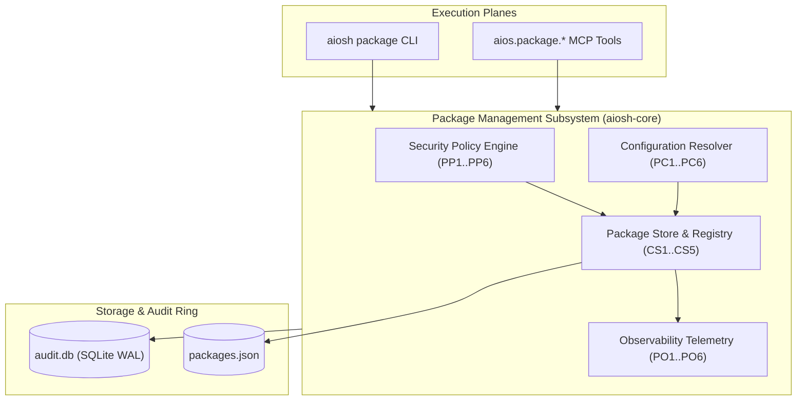

# AIOS Package Management Subsystem: Architecture & Operational Guide

## 1. Executive Overview & Architectural Role
Phase 1 of AIOS builds the core bootable target and base Linux operating system environment. The **Package Management Subsystem** (`aiosh-core::package`, `package_service`, `package_config`, `package_policy`, `package_observability`) provides a unified, deterministic, and security-governed package management layer across multiple Linux distribution packaging standards:
- **`deb`**: Debian / Ubuntu package format.
- **`apk`**: Alpine Linux package format.
- **`flatpak`**: Sandboxed application runtime bundles.
- **`tarball`**: Rootfs filesystem archives.

The subsystem abstracts disparate low-level package formats into a consistent, transactional object model. It enables deterministic transaction planning, dependency closure validation, cryptographic integrity verification, organizational policy enforcement, footprint telemetry, and autonomous execution by S-rank AI agents.



---

## 2. Core Data Model & Types
The package data model is defined in `code/aiosh-rust/aiosh-core/src/package.rs`:

### `PackageSpec`
| Field | Type | Description | Invariants Enforced |
|---|---|---|---|
| `name` | `String` | Lowercase alphanumeric package name (`^[a-z0-9][a-z0-9+.-]*$`) | `PM1`, length $[1 \dots 128]$ |
| `version` | `String` | Semantic package release string | `PM2`, length $[1 \dots 64]$ |
| `architecture` | `String` | Target hardware architecture (`amd64`, `x86_64`, `aarch64`, `riscv64`, `all`) | `PM2`, length $[1 \dots 32]$ |
| `format` | `PackageFormat` | Distribution format enum (`deb`, `apk`, `flatpak`, `tarball`) | Valid enum variant |
| `state` | `PackageState` | Current operational state | `PM5`, valid state transitions |
| `description` | `String` | Human-readable package description | `PM2`, length $\le 4096$ bytes |
| `installed_size_bytes` | `u64` | Disk consumption footprint in bytes | `PM2`, $\le 100\text{ GiB}$; `PM5`, $>0$ if installed |
| `sha256` | `Option<String>` | Lowercase hex SHA-256 digest (`^[0-9a-f]{64}$`) | `PM4`, exactly 64 hex chars if present |
| `repository_url` | `Option<String>` | Upstream repository URL | `PM4`, strictly `https://` or `file://` |
| `dependencies` | `Vec<PackageDependency>` | Required package dependencies | `PM2`, $\le 256$; `PM3`, no self-dependencies |

### `PackageFormat` & `PackageState`
- `PackageFormat`: `Deb`, `Apk`, `Flatpak`, `Tarball`.
- `PackageState`:
  - `Available`: Known in repository index, not installed locally.
  - `Installed`: Deployed in local rootfs.
  - `Upgradable`: Installed locally, newer version available in repository index.
  - `PendingInstall`: Queued for installation in active transaction.
  - `PendingRemoval`: Queued for removal in active transaction.
  - `Broken`: Failed dependency closure or corrupted state requiring remediation.

### Invariants (PM1..PM5)
- **PM1**: Package naming syntax validation matching Debian and Alpine standards (`^[a-z0-9][a-z0-9+.-]*$`, length $1 \dots 128$).
- **PM2**: Parameter sizing and collection bounds (version $\le 64$, desc $\le 4096$, dependencies $\le 256$, size $\le 100\text{ GiB}$, actions $\le 256$).
- **PM3**: Dependency hygiene (no self-dependencies `dep.name != spec.name`, no duplicates, non-empty constraint bounds).
- **PM4**: Provenance & cryptographic integrity (mandatory 64-hex SHA-256 digests and HTTPS/file repository transport).
- **PM5**: State consistency (installed packages strictly mandate `installed_size_bytes > 0`).

---

## 3. Core Service, Store Registry & Transaction Lifecycle
Implemented in `code/aiosh-rust/aiosh-core/src/package_service.rs`:

### `PackageStore` Registry
The `PackageStore` manages the system package catalog. When initialized without arguments (`PackageStore::new()`), it pre-seeds reference baseline packages:
- **Debian 12 Reference Packages**: `libc6`, `coreutils`, `bash`, `libssl3`, `curl`.
- **Alpine 3.19 Reference Packages**: `musl`, `busybox`, `apk-tools`.

### Transaction Lifecycle & Invariants (CS1..CS5)
1. **Action Batch Proposal**: Operator or AI agent proposes a batch of actions (`install`, `upgrade`, `remove`, `reinstall`).
2. **Deterministic Plan Synthesis (`CS2`)**:
   - `PackageStore::plan_transaction` validates dependencies and computes total size deltas.
   - Transaction ID is generated via deterministic SHA-256 hash over serialized actions and net delta bytes.
3. **Dependency Closure Validation (`CS3`)**:
   - For every action, all dependencies must either already be `Installed` in the store or scheduled as an `Install` action within the same transaction batch.
4. **Delta Arithmetic & Anti-Tampering (`CS4`)**:
   - Net size delta is mathematically calculated: additions sum installed sizes, removals subtract installed sizes.
   - Any external tampering with transaction delta values is detected and rejected.
5. **Atomic Disk Persistence (`CS5`)**:
   - Mutations are written to `<store_path>.tmp` and atomically renamed to `<store_path>`.
   - On error, temporary files are removed via RAII cleanup guards.
   - Reads enforce a 10 MiB stream ceiling and 10,000 package entity limit.

---

## 4. Configuration Subsystem
Implemented in `code/aiosh-rust/aiosh-core/src/package_config.rs`:

### `PackageConfig` Schema
```json
{
  "store_path": "/var/lib/aios/packages.json",
  "max_store_size_bytes": 10485760,
  "max_entity_count": 10000,
  "allowed_repositories": [
    "https://deb.debian.org/debian",
    "https://dl-cdn.alpinelinux.org/alpine"
  ],
  "default_format": "deb",
  "auto_update": false
}
```

### Precedence Hierarchy (PC5)
1. **Explicit File**: Specified via `--config <path>` in CLI or MCP arguments.
2. **Environment Variables**:
   - `AIOS_PACKAGE_STORE_PATH`
   - `AIOS_PACKAGE_MAX_STORE_SIZE_BYTES`
   - `AIOS_PACKAGE_MAX_ENTITY_COUNT`
   - `AIOS_PACKAGE_ALLOWED_REPOSITORIES` (comma-separated)
   - `AIOS_PACKAGE_DEFAULT_FORMAT`
   - `AIOS_PACKAGE_AUTO_UPDATE`
3. **Secure Defaults**: Embedded defaults (`deb` format, 10 MiB max size, 10,000 max entities).

### Invariants (PC1..PC6)
- **PC1**: Store path validity (printable ASCII, length $\le 1024$, no control characters).
- **PC2**: Store size ceiling ($[64\text{ KiB} \dots 100\text{ MiB}]$).
- **PC3**: Entity count bounds ($[10 \dots 100,000]$).
- **PC4**: Repository transport security (strictly `https://` or `file://`).
- **PC5**: Deterministic precedence (File > Env > Defaults).
- **PC6**: 64 KiB read stream bounding on configuration files.

---

## 5. Security Policy Subsystem
Implemented in `code/aiosh-rust/aiosh-core/src/package_policy.rs`:

### `PackageSecurityPolicy`
The policy engine enforces enterprise security baselines, supply chain validation, and hygiene rules:

| Invariant | Title | Policy Rule |
|---|---|---|
| **PP1** | Configuration Bounds | Architectures $\le 64$, prohibited list $\le 1024$, size $[10\text{ KiB} \dots 100\text{ GiB}]$, dependencies $[1 \dots 1024]$. |
| **PP2** | Prohibited Packages | Case-insensitive blocking of legacy, unencrypted, or insecure networking tools: `telnet`, `rsh-client`, `rsh-server`, `rlogin`, `rexec`, `nis`, `yp-tools`. |
| **PP3** | Mandatory Checksums | When `require_checksum = true`, package must supply a valid 64-character lowercase hexadecimal SHA-256 hash. |
| **PP4** | Transport Security | When `require_https_or_file_repo = true`, repository URLs must strictly begin with `https://` or `file://`. Plaintext `http://` is unconditionally blocked. |
| **PP5** | System Hygiene | Target architecture whitelisting, format verification, and size ceiling checks. |
| **PP6** | Operational Modes | Supports `Enforcing` (fail-closed, denies fatal violations), `Audit` (permits operations while recording audit records), and `Permissive` (blocks only PP2 prohibited packages). |

---

## 6. Observability Telemetry Subsystem
Implemented in `code/aiosh-rust/aiosh-core/src/package_observability.rs`:

### `PackageObservabilityReport`
Generates deterministic, read-only telemetry snapshots across the package ecosystem:
- **PO1**: Inventory completeness (exact total count matching breakdown sums).
- **PO2**: Multi-dimensional breakdown distributions:
  - `state_breakdown`: Counts by operational state (`available`, `installed`, `upgradable`, etc.).
  - `format_breakdown`: Counts by format (`deb`, `apk`, `flatpak`, `tarball`).
  - `architecture_breakdown`: Counts by target CPU architecture (`amd64`, `x86_64`, `aarch64`, etc.).
- **PO3**: Footprint telemetry:
  - `total_installed_size_bytes`: Net disk usage of `Installed` and `Upgradable` packages computed via `u64::saturating_add`.
  - `average_package_size_bytes`: Mean package size across all known packages.
- **PO4**: Categorical dependency distribution histogram:
  - Categorized into 4 fixed buckets: `"0"`, `"1-5"`, `"6-10"`, `"11+"` for $O(1)$ memory usage.
- **PO5**: Policy compliance audit:
  - `policy_compliant_count`, `policy_violations_count`, and `prohibited_packages_found`.
- **PO6**: Deterministic serialization:
  - Standard JSON output with ISO timestamps and complete error envelopes.

---

## 7. Operator CLI Surface Reference

### Command Syntax & Options
```bash
aiosh package <validate|list|show|search|plan|apply|config|policy|stats> [OPTIONS]
```

### 1. `validate`
```bash
# Validate package naming syntax
aiosh package validate --name "curl"

# Deep-audit a package specification payload
aiosh package validate --spec '{"name":"curl","version":"8.5.0","architecture":"amd64","format":"deb","state":"available","description":"curl","installed_size_bytes":1000,"dependencies":[]}'
```

### 2. `list`
```bash
# List all packages in table format
aiosh package list

# Filter by format, state, and name pattern with JSON output
aiosh package list --format deb --state installed --pattern "lib" --limit 50 --json
```

### 3. `show`
```bash
# Deep inspect package metadata and dependencies
aiosh package show curl
```

### 4. `search`
```bash
# Search packages by name or description
aiosh package search ssl --limit 10 --json
```

### 5. `plan`
```bash
# Plan a multi-package installation transaction (dry-run)
aiosh package plan --actions '[{"action":"install","package_name":"libssl3"},{"action":"install","package_name":"curl"}]' --dry-run --json
```

### 6. `apply`
```bash
# Apply an installation transaction and persist store mutations
aiosh package apply --actions '[{"action":"install","package_name":"libssl3"},{"action":"install","package_name":"curl"}]' --store /var/lib/aios/packages.json --json
```

### 7. `config`
```bash
# Inspect resolved package configuration and limits
aiosh package config --json
```

### 8. `policy`
```bash
# Inspect active security policy rules
aiosh package policy --json

# Evaluate policy compliance for a specific package
aiosh package policy --package telnet --json
```

### 9. `stats`
```bash
# View comprehensive package observability telemetry report
aiosh package stats --json
```

### 10. `check`
```bash
# Verify store integrity and validate all package specs (RV1..RV3)
aiosh package check --json

# Automatically heal corrupted store with timestamped backup (RV4)
aiosh package check --store /var/lib/aios/packages.json --fix --json
```

---

## 8. Autonomous Agent MCP Tool Surface Reference
Model Context Protocol tools exposed under `aios.package.*` in `aiosh-mcp`:

| Tool Name | Parameters | Description |
|---|---|---|
| `aios.package.validate` | `name?: string, spec?: object` | Validates package naming syntax or full specification against PM1..PM5. |
| `aios.package.list` | `format?: string, state?: string, pattern?: string, limit?: number, store_path?: string` | Enumerates packages matching query filters. |
| `aios.package.get` | `name: string, store_path?: string` | Retrieves complete package record by name. |
| `aios.package.plan` | `actions: array, dry_run?: boolean, store_path?: string` | Plans transaction with dependency closure validation. |
| `aios.package.search` | `pattern: string, limit?: number, store_path?: string` | Substring search over package repository. |
| `aios.package.apply` | `actions?: array, plan?: object, dry_run?: boolean, store_path?: string` | Applies package mutations and persists store updates. |
| `aios.package.config` | `config_path?: string` | Retrieves active package configuration settings. |
| `aios.package.policy` | `package?: string, config_path?: string` | Evaluates security policy compliance and prohibited items. |
| `aios.package.stats` | `store_path?: string, config_path?: string` | Retrieves observability and telemetry analytics report. |
| `aios.package.check` | `store_path?: string, auto_recover?: boolean` | Checks store integrity and optionally recovers corrupted store. |

### Example Agent JSON-RPC Tool Invocations

#### Planning a Transaction (`aios.package.plan`):
```json
{
  "jsonrpc": "2.0",
  "id": 101,
  "method": "tools/call",
  "params": {
    "name": "aios.package.plan",
    "arguments": {
      "actions": [
        { "action": "install", "package_name": "libssl3" },
        { "action": "install", "package_name": "curl" }
      ],
      "dry_run": true
    }
  }
}
```

#### Querying Observability Statistics (`aios.package.stats`):
```json
{
  "jsonrpc": "2.0",
  "id": 102,
  "method": "tools/call",
  "params": {
    "name": "aios.package.stats",
    "arguments": {}
  }
}
```

#### Verifying Store Integrity & Self-Healing (`aios.package.check`):
```json
{
  "jsonrpc": "2.0",
  "id": 103,
  "method": "tools/call",
  "params": {
    "name": "aios.package.check",
    "arguments": {
      "auto_recover": true
    }
  }
}
```

---

## 9. Failure Modes, Error Envelopes, and Audit Trail

### Standard Error Envelopes
All CLI subcommands (`--json`) and MCP tool invocations report results in standard JSON envelopes:

```json
{
  "code": 1,
  "data": null,
  "error": {
    "code": "LOAD_STORE_FAILED",
    "message": "failed to load store from /nonexistent/path: file not found"
  }
}
```

### Recognized Error Codes
- `INVALID_ARGUMENT`: Input exceeds character limits, contains control characters, or violates syntax rules.
- `PACKAGE_NOT_FOUND`: Target package name does not exist in store.
- `LOAD_STORE_FAILED`: Store file corrupted, unreadable, or exceeding 10 MiB limit.
- `LOAD_POLICY_FAILED`: Policy configuration file invalid or unreadable.
- `PAYLOAD_TOO_LARGE`: Actions or specification input exceeds 1 MiB ceiling.
- `INVALID_JSON`: Malformed JSON syntax in input file or arguments.
- `FILE_READ_ERROR`: Filesystem I/O failure during payload ingestion.
- `PLAN_FAILED`: Transaction planning failed dependency closure or delta checks.
- `PERSISTENCE_FAILED`: Atomic store write or rename operation failed.
- `CONFIG_RESOLUTION_FAILED`: Configuration hierarchy resolution failed invariants PC1..PC6.
- `RECOVERY_FAILED`: Automated store restoration failed during backup or file reseeding.
- `UNHEALTHY_STORE`: Store integrity check identified package specification or capacity errors.

### Store Recovery & Validation Invariants (RV1..RV4)
- **`RV1` (Count Conservation)**: $\text{valid\_packages} + \text{invalid\_packages} = \text{total\_packages}$.
- **`RV2` (Health Equivalence)**: $\text{healthy} \iff (\text{errors.is\_empty}() \land \text{invalid\_packages} == 0)$.
- **`RV3` (Error Completeness)**: $\text{errors.len}() \ge \text{invalid\_packages}$ (every invalid package yields explicit error diagnostics).
- **`RV4` (Non-Destructive Forensic Preservation)**: Corrupted stores are immutably archived to `<path>.bak.<timestamp>` before any reseed occurs.

### Non-Repudiation Audit Trail
- **CLI Logging**: Every execution path in `aiosh package` calls `classify_and_emit`, recording action, parameters, success/failure status, error classification, and actor to `audit.db`.
- **MCP Logging**: Every tool dispatch under `aios.package.*` invokes `dispatch::recorded_call`, writing an immutable SHA-256 hash-chained entry to the SQLite WAL ring buffer before returning responses.
- **Fail-Closed Guarantees**: Any failure on an explicit security policy or store loading path emits an honest failure audit row (per ADR-0035 §F-2), preventing stealth evasion.
