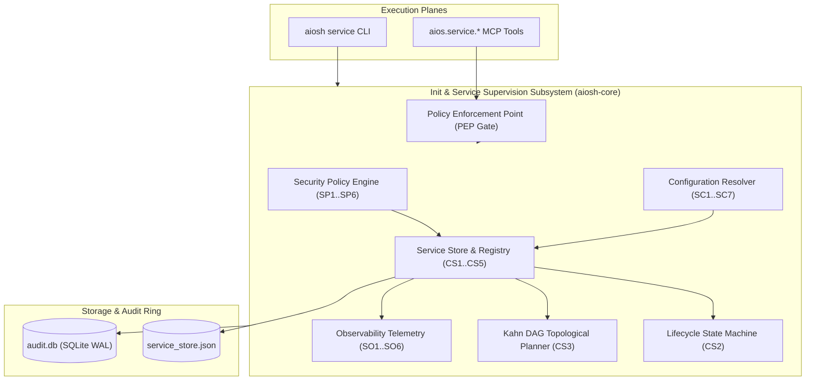

# AIOS Init & Service Supervision Subsystem: Architecture & Operational Guide

## 1. Executive Overview & Architectural Role
Phase 1 of AIOS establishes the core Linux base operating system and bootable target. The **Init & Service Supervision Subsystem** (`aiosh-core::service`, `service_service`, `service_config`, `service_policy`, `service_observability`) provides a deterministic, secure, and observable process supervision layer bridging systemd and OpenRC semantic boundaries:
- **`systemd`**: Canonical Linux service unit semantics (`.service`), cgroup v2 hierarchy integration, and activation ordering.
- **`OpenRC`**: Dependency-based initialization sequencing and runlevel abstractions.
- **`Autonomous AI Control`**: Programmatic lifecycle manipulation by S-rank AI agents over standard Model Context Protocol (MCP) tool interfaces.

The subsystem unifies disparate process supervision patterns into a strongly-typed, verifiable architecture. It enforces strict naming and command validation, topological dependency resolution via Kahn's algorithm, automated health telemetry and restart monitoring, organizational security policy gating, and immutable SHA-256 hash-chained audit logging to the SQLite WAL ring buffer.



---

## 2. Core Data Model & Types
The service data model is implemented in `code/aiosh-rust/aiosh-core/src/service.rs`:

### `ServiceSpec`
| Field | Type | Description | Invariants Enforced |
|---|---|---|---|
| `name` | `String` | Unique service unit identifier matching systemd/OpenRC standard | `SS1`, length $[1 \dots 128]$, `^[a-zA-Z0-9][a-zA-Z0-9_.-]*$` |
| `description` | `String` | Human-readable explanation of service function | `SS4`, length $\le 4096$ bytes |
| `exec_start` | `String` | Primary daemon execution command | `SS2`, absolute path, no directory traversal `..` |
| `exec_stop` | `Option<String>` | Optional graceful shutdown command | `SS2`, absolute path if present |
| `exec_reload` | `Option<String>` | Optional configuration reload command | `SS2`, absolute path if present |
| `service_type` | `ServiceType` | Execution architecture model enum | Valid enum variant |
| `restart_policy` | `ServiceRestartPolicy` | Process crash recovery policy enum | Valid enum variant |
| `startup_mode` | `ServiceStartupMode` | Boot-time enablement state enum | Valid enum variant |
| `user` | `Option<String>` | Target execution user account | `SP4`, checked against root policy |
| `group` | `Option<String>` | Target execution group account | Alphanumeric account string |
| `working_dir` | `Option<String>` | Process working directory | `SS2`, `SP3`, absolute path, not in `/tmp` |
| `environment` | `BTreeMap<String, String>` | Environment variable map | `SS4`, $\le 1024$; `SP5`, no `LD_PRELOAD`, `IFS` |
| `dependencies` | `Vec<ServiceDependency>` | Ordered dependency declarations | `SS3`, $\le 256$, no self-dependencies |
| `timeout_start_secs` | `u64` | Maximum startup window in seconds | `SS4`, $[1 \dots 86400]$ seconds |
| `timeout_stop_secs` | `u64` | Maximum shutdown window in seconds | `SS4`, $[1 \dots 86400]$ seconds |

### Enumerations & Types
- **`ServiceType`**: `Simple`, `Exec`, `Forking`, `Oneshot`, `Notify`, `Idle`.
- **`ServiceRestartPolicy`**: `No`, `Always`, `OnSuccess`, `OnFailure`, `OnAbnormal`, `OnWatchdog`, `OnAbort`.
- **`ServiceStartupMode`**:
  - `Enabled`: Automatically started during boot sequence.
  - `Disabled`: Inactive during boot; manual or dependency activation permitted.
  - `Masked`: Completely prohibited from starting or being enabled.
  - `Static`: Base system service managed exclusively by underlying OS.
- **`ServiceState`**:
  - `Active`: Running normally with valid health check.
  - `Inactive`: Stopped gracefully; zero running processes.
  - `Activating`: In process of executing `exec_start`.
  - `Deactivating`: In process of executing `exec_stop`.
  - `Failed`: Non-zero exit code or fatal error during execution.
  - `Reloading`: Executing `exec_reload` to refresh configuration.
  - `Unknown`: Unrecognized state requiring reconciliation.
- **`ServiceDependencyType`**: `Requires`, `Wants`, `Before`, `After`, `Conflicts`.

### Invariants (SS1..SS5)
- **SS1**: Service naming syntax conforms strictly to systemd/OpenRC requirements (`^[a-zA-Z0-9][a-zA-Z0-9_.-]*$`, length $1 \dots 128$).
- **SS2**: Command execution hygiene mandates absolute binary paths and prohibits directory traversal sequences (`..`).
- **SS3**: Dependency graph hygiene strictly prohibits self-dependencies (`dep.name != spec.name`) and redundant duplicates.
- **SS4**: Parameter and resource bounds enforce timeouts within $[1 \dots 86400]$s and environment variable counts $\le 1024$.
- **SS5**: Lifecycle state consistency ensures valid state transitions and FSM determinism.

---

## 3. Core Service, Store Registry & Lifecycle State Machine
Implemented in `code/aiosh-rust/aiosh-core/src/service_service.rs`:

### `ServiceStore` Registry
The `ServiceStore` provides thread-safe, in-memory service management. Initialized with reference baseline services:
- **`aios-securityd.service`**: Core AIOS security kernel and PEP daemon.
- **`auditd.service`**: Immutable audit ring and hash-chain logging daemon.
- **`dbus.service`**: System message bus for inter-process communication.
- **`systemd-journald.service`**: Core system logging daemon.
- **`ssh.service`**: Secure remote administrative access daemon.

### Invariants & Engine Rules (CS1..CS5)
1. **Registry Uniqueness (`CS1`)**: Services must have unique names; duplicate registrations are rejected.
2. **Lifecycle FSM Transitions (`CS2`)**:
   - `start`: Transitions `Inactive` or `Failed` $\to$ `Active`.
   - `stop`: Transitions `Active` $\to$ `Inactive`.
   - `restart`: Transitions `Active` or `Failed` $\to$ `Inactive` $\to$ `Active`, resetting restart counters.
   - `reload`: Executes configuration refresh on `Active` services without dropping state.
   - `enable` / `disable`: Alters startup mode between `Enabled` and `Disabled`.
   - `mask` / `unmask`: Sets or removes `Masked` state. Active services must be stopped before masking.
3. **Topological Ordering via Kahn's Algorithm (`CS3`)**:
   - Computes deterministic startup sequences in linear time $O(V + E)$.
   - Validates Directed Acyclic Graphs (DAG) and detects circular dependency deadlocks, returning explicit cycle errors.
4. **Multi-Parameter Querying (`CS4`)**:
   - Filter by name pattern, lifecycle state, and startup mode with limit bounds.
5. **Atomic Disk Persistence (`CS5`)**:
   - Persists state via atomic tempfile rename (`<store_path>.tmp` $\to$ `<store_path>`) with PID isolation.
   - Enforces a 10 MiB stream ceiling and 10,000 entity maximum.

### Automated Integration Matrix (ST1..ST5)
- **ST1**: Deterministic multi-step lifecycle transitions and FSM state validation.
- **ST2**: Topological dependency sequencing and circular dependency detection.
- **ST3**: Atomic persistence and reload roundtrip with disk parity.
- **ST4**: Store entity boundaries and payload sizing limits.
- **ST5**: Error handling and invalid transition rejection.

---

## 4. Configuration Subsystem
Implemented in `code/aiosh-rust/aiosh-core/src/service_config.rs`:

### `ServiceConfig` Schema
```json
{
  "store_path": "/var/lib/aios/service_store.json",
  "default_timeout_start_secs": 30,
  "default_timeout_stop_secs": 30,
  "max_store_size_bytes": 10485760,
  "max_entity_count": 10000,
  "auto_persist": true,
  "restart_backoff_secs": 5,
  "max_restart_burst": 5
}
```

### Precedence Hierarchy (SC5)
1. **Explicit File**: Specified via `--config <path>` in CLI or MCP arguments.
2. **Environment Variables**:
   - `AIOS_SERVICE_STORE_PATH`
   - `AIOS_SERVICE_TIMEOUT_START_SECS`
   - `AIOS_SERVICE_TIMEOUT_STOP_SECS`
   - `AIOS_SERVICE_MAX_STORE_SIZE_BYTES`
   - `AIOS_SERVICE_MAX_ENTITY_COUNT`
   - `AIOS_SERVICE_AUTO_PERSIST`
   - `AIOS_SERVICE_RESTART_BACKOFF_SECS`
   - `AIOS_SERVICE_MAX_RESTART_BURST`
3. **Secure Defaults**: Embedded defaults (30s timeouts, 10 MiB max size, 10,000 max entities, auto-persist enabled).

### Invariants (SC1..SC7)
- **SC1**: Store path validity (length $\le 1024$, no control characters).
- **SC2**: Timeout bounds ($[1 \dots 86400]$s).
- **SC3**: Store size ceiling ($[64\text{ KiB} \dots 100\text{ MiB}]$).
- **SC4**: Entity count bounds ($[10 \dots 100,000]$).
- **SC5**: Deterministic precedence (File > Env > Defaults).
- **SC6**: Process restart backoff and burst parameters bounded against DoS flapping.
- **SC7**: 64 KiB read stream bounding on configuration files.

---

## 5. Security Policy Subsystem
Implemented in `code/aiosh-rust/aiosh-core/src/service_policy.rs`:

### `ServiceSecurityPolicy`
The security policy engine enforces least privilege (NIST SP 800-53 AC-6) and least functionality (CM-7):

| Invariant | Title | Policy Rule |
|---|---|---|
| **SP1** | Configuration Bounds | Prohibited services $\le 1024$, prohibited paths $\le 128$, timeouts $[1 \dots 86400]$s. |
| **SP2** | Prohibited Daemons | Case-insensitive rejection of insecure legacy daemons: `telnet.service`, `rsh.service`, `rlogin.service`, `rexec.service`, `tftp.service`, `xinetd.service`, `ypserv.service`, `ypbind.service`. |
| **SP3** | Executable Path Hygiene | Prohibits relative paths, directory traversal (`..`), and execution from world-writable directories (`/tmp`, `/var/tmp`, `/dev/shm`, `/run/user`). |
| **SP4** | User Privilege & Root Restriction | Enforces unprivileged execution via `require_service_user` and `disallow_root`. Core root daemons must be explicitly whitelisted in `allowed_root_services`. |
| **SP5** | Environment Sanitization | Blocks dynamic linker injection vectors (`LD_PRELOAD`, `LD_LIBRARY_PATH`, `IFS`), limits environment variables $\le 1024$, and bounds timeouts. |
| **SP6** | Operational Modes | Supports `Enforcing` (fail-closed, blocks fatal violations), `Audit` (permits operations while recording audit records), and `Permissive` (blocks only SP2 prohibited services). |

---

## 6. Observability Telemetry Subsystem
Implemented in `code/aiosh-rust/aiosh-core/src/service_observability.rs`:

### `ServiceObservabilityReport`
Generates deterministic, read-only telemetry snapshots across the service ecosystem:
- **SO1**: Inventory completeness with exact mathematical conservation:
  $$\sum \text{state} = \sum \text{mode} = \sum \text{type} = \sum \text{policy} = \text{total\_services}$$
- **SO2**: Categorical breakdowns across state (`active`, `inactive`, `failed`), mode (`enabled`, `disabled`, `masked`, `static`), type (`simple`, `forking`, `oneshot`, `notify`), and restart policy (`always`, `on_failure`, `no`).
- **SO3**: Health accounting (`healthy_count`, `unhealthy_count`), tracking of failed service names, and process restart counters aggregated with saturation arithmetic (`u32::saturating_add`).
- **SO4**: Fixed-bucket dependency histogram buckets (`"0"`, `"1-2"`, `"3-5"`, `"6+"`) ensuring $O(1)$ memory usage.
- **SO5**: Security policy compliance evaluation reporting compliant count, violations, and prohibited service detections.
- **SO6**: Deterministic JSON serialization with ISO timestamps and complete error envelopes.

---

## 7. Operator CLI Surface Reference

### Command Syntax & Subcommands
```bash
aiosh service <validate|list|show|action|start|stop|restart|reload|enable|disable|mask|unmask|order|config|policy|stats> [OPTIONS]
```

### 1. `validate`
```bash
# Validate service naming syntax
aiosh service validate --name "auditd.service"

# Validate full service specification
aiosh service validate --spec '{"name":"custom.service","description":"Custom","exec_start":"/usr/bin/custom","service_type":"simple","restart_policy":"always","startup_mode":"enabled","dependencies":[],"timeout_start_secs":30,"timeout_stop_secs":30,"environment":{}}' --json
```

### 2. `list`
```bash
# List all services in table format
aiosh service list

# Filter by state, mode, and pattern with JSON output
aiosh service list --state active --mode enabled --pattern "aios" --limit 20 --json
```

### 3. `show` / `status`
```bash
# Inspect service specification and runtime state
aiosh service show auditd.service

# Inspect in structured JSON format
aiosh service status auditd.service --json
```

### 4. `action` & Direct Shortcuts
```bash
# Execute administrative transition
aiosh service action auditd.service restart --json

# Direct command shortcuts
aiosh service start auditd.service
aiosh service stop auditd.service
aiosh service restart auditd.service
aiosh service reload auditd.service
aiosh service enable auditd.service
aiosh service disable auditd.service
aiosh service mask auditd.service
aiosh service unmask auditd.service
```

### 5. `order`
```bash
# Plan topological startup activation order
aiosh service order aios-securityd.service --json
```

### 6. `config`
```bash
# Inspect resolved supervision configuration
aiosh service config --json
```

### 7. `policy`
```bash
# Inspect active security policy rules
aiosh service policy --json

# Evaluate security policy against a target service
aiosh service policy --service telnet.service --json
```

### 8. `stats` / `observability`
```bash
# Display comprehensive service supervision observability report
aiosh service stats --json
```

### 9. `check`
```bash
# Validate on-disk service store integrity (read-only audit)
aiosh service check --store /var/lib/aios/services.json --json

# Automatically repair corrupted or invalid store with non-destructive backup
aiosh service check --store /var/lib/aios/services.json --fix --json
```

---

## 8. Autonomous Agent MCP Tool Surface Reference (`aios.service.*`)

The Init & Service Supervision tools provide programmatic control over platform services via standard MCP JSON-RPC 2.0:

### 1. `aios.service.validate`
```json
{
  "jsonrpc": "2.0",
  "id": 1,
  "method": "tools/call",
  "params": {
    "name": "aios.service.validate",
    "arguments": {
      "name": "auditd.service"
    }
  }
}
```

### 2. `aios.service.list`
```json
{
  "jsonrpc": "2.0",
  "id": 2,
  "method": "tools/call",
  "params": {
    "name": "aios.service.list",
    "arguments": {
      "state": "active",
      "pattern": "audit"
    }
  }
}
```

### 3. `aios.service.get`
```json
{
  "jsonrpc": "2.0",
  "id": 3,
  "method": "tools/call",
  "params": {
    "name": "aios.service.get",
    "arguments": {
      "name": "auditd.service"
    }
  }
}
```

### 4. `aios.service.action`
```json
{
  "jsonrpc": "2.0",
  "id": 4,
  "method": "tools/call",
  "params": {
    "name": "aios.service.action",
    "arguments": {
      "name": "auditd.service",
      "action": "restart"
    }
  }
}
```

### 5. `aios.service.order`
```json
{
  "jsonrpc": "2.0",
  "id": 5,
  "method": "tools/call",
  "params": {
    "name": "aios.service.order",
    "arguments": {
      "name": "aios-securityd.service"
    }
  }
}
```

### 6. `aios.service.config`
```json
{
  "jsonrpc": "2.0",
  "id": 6,
  "method": "tools/call",
  "params": {
    "name": "aios.service.config",
    "arguments": {}
  }
}
```

### 7. `aios.service.policy`
```json
{
  "jsonrpc": "2.0",
  "id": 7,
  "method": "tools/call",
  "params": {
    "name": "aios.service.policy",
    "arguments": {
      "service_name": "telnet.service"
    }
  }
}
```

### 8. `aios.service.stats`
```json
{
  "jsonrpc": "2.0",
  "id": 8,
  "method": "tools/call",
  "params": {
    "name": "aios.service.stats",
    "arguments": {}
  }
}
```

### 9. `aios.service.check`
```json
{
  "jsonrpc": "2.0",
  "id": 9,
  "method": "tools/call",
  "params": {
    "name": "aios.service.check",
    "arguments": {
      "store_path": "/var/lib/aios/services.json",
      "auto_recover": true
    }
  }
}
```

---

## 9. Failure Modes, Error Envelopes, and Audit Trail

### Standard Error Envelope
All error responses adhere to the standard JSON result envelope defined in ADR-0035:
```json
{
  "code": 2,
  "data": null,
  "error": {
    "code": "INVALID_ARGUMENT",
    "message": "Service name 'invalid/name' is invalid: contains illegal character '/'"
  }
}
```

### Structured Error Codes
- **`INVALID_ARGUMENT`**: Malformed service name, invalid action verb, oversized path, or control character detected.
- **`SERVICE_NOT_FOUND`**: Target service unit does not exist in active registry.
- **`LOAD_STORE_FAILED`**: Failed to read or parse service store JSON from disk.
- **`LOAD_POLICY_FAILED`**: Failed to read or parse service security policy JSON.
- **`PERSIST_FAILED`**: Filesystem I/O error during atomic store persistence.
- **`ACTION_FAILED`**: State transition rejected by FSM (e.g., attempt to start a masked service).
- **`ORDER_FAILED`**: Cyclic dependency deadlock detected during Kahn topological ordering.
- **`CONFIG_RESOLUTION_FAILED`**: Failed to resolve configuration file or parameters.
- **`POLICY_RESOLUTION_FAILED`**: Failed to resolve security policy configuration.
- **`PAYLOAD_TOO_LARGE`**: Supplied configuration or store exceeds size ceilings.

### Non-Repudiation Audit Trail
- **CLI Logging**: Every operator command invokes `classify_and_emit`, writing an immutable event record to `audit.db` and `audit.log`.
- **MCP Logging**: Every autonomous agent tool invocation executes via `dispatch::recorded_call`, enforcing PEP capability tokens (`grant_id`) and recording an auditable event with SHA-256 hash chains.
