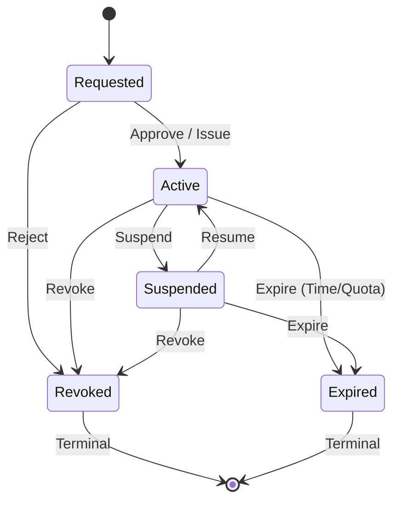

# Specification: Grant Lifecycle Data Model (PEPGRANT1..PEPGRANT6)

## 1. Scope & Purpose
Defines the authoritative Rust data model and state machine for authorization grants in the AIOS Security Kernel & PEP Fabric. Grants encapsulate delegated capabilities, enforce temporal and volumetric quotas, and maintain tamper-evident lifecycle state.

## 2. Invariants (`PEPGRANT1..PEPGRANT6`)
| Invariant | Name | Specification |
|---|---|---|
| **`PEPGRANT1`** | **Finite State Machine & Monotonic Lifecycle** | Valid states: `Requested`, `Active`, `Suspended`, `Revoked`, `Expired`. Terminal states `Revoked` and `Expired` are irreversible. |
| **`PEPGRANT2`** | **Identifier & Principal Validation** | `id`, `issuer`, and `subject` must be $\le 128$ ASCII chars, free of control characters, NUL bytes, and whitespace. Scopes must pass path traversal checks. |
| **`PEPGRANT3`** | **Monotonic Rights & Scope Attenuation** | Child grants created from a parent grant must possess a subset of the parent's rights and a narrowed or equal scope. `max_delegation_depth` strictly decrements. |
| **`PEPGRANT4`** | **Bounded Temporal & Quota Constraints** | Evaluates `not_before` and `expires_at` against UTC timestamps. Tracks `invocations_used` and `bytes_used`. Automatically detects expiration or quota exhaustion. |
| **`PEPGRANT5`** | **Non-Destructive Revocation** | Revoking a grant retains full immutable context (`revoked_at`, `revoked_by`, `reason`). Revocation recursively invalidates child grants. |
| **`PEPGRANT6`** | **Lossless Serialization & Standard Error Codes** | Canonical JSON roundtrip parity. Strongly-typed errors with machine-readable `PEPGRANT_ERR_*` error constants. |

## 3. Rust Type Definitions

```rust
#[derive(Debug, Clone, Copy, PartialEq, Eq, Serialize, Deserialize)]
#[serde(rename_all = "snake_case")]
pub enum PepGrantState {
    Requested,
    Active,
    Suspended,
    Revoked,
    Expired,
}

#[derive(Debug, Clone, PartialEq, Eq, Serialize, Deserialize)]
pub struct PepGrantRevocation {
    pub revoked_at: String,
    pub revoked_by: String,
    pub reason: String,
}

#[derive(Debug, Clone, PartialEq, Eq, Serialize, Deserialize, Default)]
pub struct PepGrantConstraints {
    pub not_before: Option<String>,
    pub expires_at: Option<String>,
    pub max_invocations: Option<u64>,
    pub invocations_used: u64,
    pub max_bytes: Option<u64>,
    pub bytes_used: u64,
    pub max_delegation_depth: u32,
}

#[derive(Debug, Clone, PartialEq, Eq, Serialize, Deserialize)]
pub struct PepGrant {
    pub id: String,
    pub parent_grant_id: Option<String>,
    pub issuer: String,
    pub subject: String,
    pub scope: CapabilityScope,
    pub rights: Vec<CapabilityRight>,
    pub state: PepGrantState,
    pub constraints: PepGrantConstraints,
    pub revocation: Option<PepGrantRevocation>,
    pub metadata: std::collections::HashMap<String, String>,
    pub created_at: String,
    pub updated_at: String,
}
```

## 4. State Transition Rules


## 5. Error Contract
- `PEPGRANT_ERR_INVALID_TRANSITION`: Attempted transition from terminal state or illegal path.
- `PEPGRANT_ERR_INVALID_ID`: Malformed ID, issuer, or subject string.
- `PEPGRANT_ERR_EXPIRED`: Target grant is past its expiration time.
- `PEPGRANT_ERR_NOT_YET_VALID`: Target grant cannot be used before `not_before`.
- `PEPGRANT_ERR_QUOTA_EXCEEDED`: Invocations or bytes exceed configured limit.
- `PEPGRANT_ERR_REVOKED`: Operation attempted on revoked grant.
- `PEPGRANT_ERR_ATTENUATION`: Child grant requested permissions outside parent grant bounds.
- `PEPGRANT_ERR_VALIDATION`: General validation failure.
