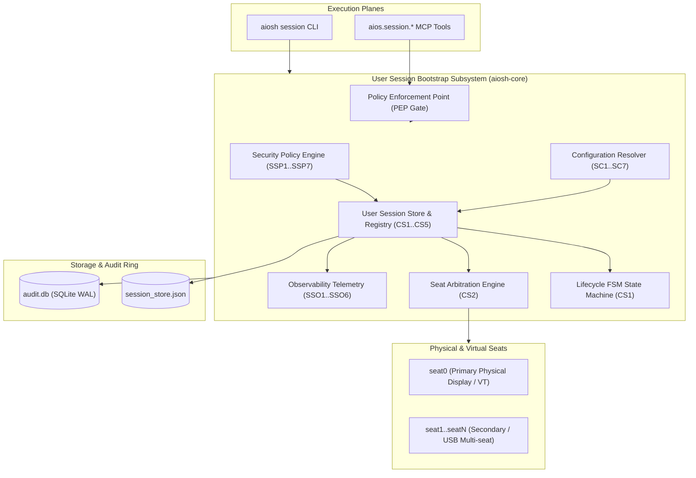

# AIOS User Session Bootstrap Subsystem: Architecture & Operational Guide

## 1. Executive Overview & Architectural Role
Phase 1 of AIOS establishes the foundational Linux base operating system and bootable target. The **User Session Bootstrap Subsystem** (`aiosh-core::session`, `session_service`, `session_config`, `session_policy`, `session_observability`) provides a deterministic, secure, and observable session management and hardware seat arbitration engine:
- **`logind & loginctl(1)`**: Canonical Linux seat arbitration (`seat0`), multi-seat assignments, virtual terminal (VT) allocation, display management, focus control, and session lifecycle tracking.
- **`freedesktop.org XDG`**: Runtime directory conventions (`/run/user/<uid>`), environment variable scoping, display server binding (`X11`, `Wayland`, `tty`), and inhibitor locking.
- **`Autonomous AI Control`**: Programmatic lifecycle orchestration by autonomous AI agents over standard Model Context Protocol (MCP) tool interfaces.

The subsystem unifies graphical, console, remote, and autonomous AI sessions into a strongly-typed, verifiable architecture. It enforces POSIX username and session naming syntax, seat mutual exclusion (at most one foreground session per seat with automatic background demotion), concurrent session quotas (max 32 active sessions per user), organizational security policy gating (root interactive restriction, greeter privilege containment, remote seat0 protection, dynamic linker `LD_PRELOAD` rejection), automated telemetry with state distribution metrics, and immutable SHA-256 hash-chained audit logging to the SQLite WAL ring buffer.



---

## 2. Core Data Model & Specification Invariants
The session data model is implemented in `code/aiosh-rust/aiosh-core/src/session.rs`:

### `UserSessionSpec`
| Field | Type | Description | Invariants Enforced |
|---|---|---|---|
| `session_id` | `String` | Unique session identifier | `SB1`, length $[1 \dots 64]$, `^[a-zA-Z0-9][a-zA-Z0-9_.-]*$` |
| `username` | `String` | POSIX user identity | `SB2`, length $[1 \dots 32]$, `^[a-z_][a-z0-9_-]*[$]?$` |
| `uid` | `u32` | POSIX numeric user identifier | Integer in valid range |
| `gid` | `u32` | POSIX numeric group identifier | Integer in valid range |
| `session_type` | `SessionType` | Execution environment (`Tty`, `X11`, `Wayland`, `AiAgent`) | Valid enum variant |
| `session_class` | `SessionClass` | Functional classification (`User`, `Greeter`, `LockScreen`, `Background`, `Agent`) | Valid enum variant |
| `seat` | `String` | Physical or virtual hardware seat | `SB3`, length $[1 \dots 64]$, `^[a-zA-Z0-9_-]+$` |
| `vtnr` | `Option<u32>` | Optional virtual terminal index ($1 \dots 64$) | `SB5`, integer bounds |
| `display` | `Option<String>` | Optional display server target (e.g. `:0`) | `SB5`, sanitized display syntax |
| `remote_host` | `Option<String>` | Optional remote host for SSH/RDP sessions | `SB5`, sanitized hostname/IP |
| `environment` | `BTreeMap<String, String>` | Session environment key-value map | `SB4`, key syntax `^[A-Za-z_][A-Za-z0-9_]*$`, value $\le 1024$ chars, max 256 entries |

### `UserSessionStatus`
| Field | Type | Description |
|---|---|---|
| `session_id` | `String` | Session identifier matching specification |
| `username` | `String` | POSIX username owning the session |
| `uid` | `u32` | POSIX user ID |
| `state` | `SessionState` | Current lifecycle state (`Initializing`, `Authenticating`, `Active`, `Locked`, `Terminating`, `Terminated`) |
| `scope` | `SessionScope` | Current seat focus (`Foreground`, `Background`) |
| `leader_pid` | `Option<u32>` | Process ID of the session leader daemon/shell |
| `created_at` | `String` | RFC-3339 creation timestamp |
| `last_active_at` | `String` | RFC-3339 timestamp of last observed user input or activity |
| `idle_seconds` | `u64` | Elapsed duration of user inactivity |
| `locked` | `bool` | Whether display and input are actively locked |

### Invariants Matrix (`SB1..SB5`)
- **`SB1` (Session Naming Syntax)**: Session ID must begin with alphanumeric char and contain only `[a-zA-Z0-9_.-]`, length $1 \dots 64$.
- **`SB2` (User Identity Syntax)**: Username must begin with lower letter or underscore, followed by `[a-z0-9_-]`, optional trailing `$`, length $1 \dots 32$.
- **`SB3` (Seat Identifier Syntax)**: Seat identifier must be non-empty string of `[a-zA-Z0-9_-]`, length $1 \dots 64$.
- **`SB4` (Environment Block Sanitization)**: Variable names match `^[A-Za-z_][A-Za-z0-9_]*$`, value length bounded to $\le 1024$ bytes, total entries bounded to $\le 256$.
- **`SB5` (Specification Coherence)**: Comprehensive specification validation verifying structural integrity and cross-field consistency before store insertion.

---

## 3. Core Service Registry, Lifecycle FSM & Seat Arbitration
The session lifecycle engine is implemented in `code/aiosh-rust/aiosh-core/src/session_service.rs`:

### Lifecycle FSM Transitions (`CS1`)
```
[Initializing] ---> Authenticate ---> [Authenticating] ---> Activate ---> [Active (Foreground)]
                                                                               |        ^
                                                                             Lock     Unlock
                                                                               v        |
                                                                           [Locked] ----+
                                                                               |
                                                                           Terminate
                                                                               v
                                                                          [Terminating]
                                                                               |
                                                                           Terminate
                                                                               v
                                                                          [Terminated]
```

### Invariants Matrix (`CS1..CS5`)
- **`CS1` (FSM State Integrity & Two-Stage Teardown)**: Invalid transitions (e.g. locking an unauthenticated session or activating a terminated session) are rejected with explicit error codes. Active and Locked sessions enter `Terminating` upon first terminate request for process cleanup, followed by permanent immutable `Terminated` status.
- **`CS2` (Seat Arbitration & Mutual Exclusion)**: At most one session can hold `SessionScope::Foreground` on any physical/virtual seat (e.g. `seat0`). Activating a session automatically demotes any prior foreground session on that seat to `SessionScope::Background`.
- **`CS3` (User Quota & Capacity Ceilings)**: Enforces a strict ceiling of max 32 concurrent sessions per user (`MAX_SESSIONS_PER_USER`) and max 1024 total tracked sessions in the store (`MAX_TOTAL_SESSIONS`).
- **`CS4` (Multi-Parameter Querying)**: Query interface supports combined filtering across username, lifecycle state, session type, seat, and pagination limit bounds $[1 \dots 10,000]$.
- **`CS5` (Atomic Persistence & Clean Recovery)**: Store state is serialized to JSON and persisted using atomic PID-isolated temporary file rename (`.tmp` -> final) to prevent corruption during unexpected shutdowns.

---

## 4. Configuration Subsystem (`SessionConfig`)
Implemented in `code/aiosh-rust/aiosh-core/src/session_config.rs`:

### Configuration Parameters
| Parameter | Default | Valid Range | Description | Invariant |
|---|---|---|---|---|
| `store_path` | `.aios/sessions.json` | Valid path $\le 1024$ chars | On-disk session persistence path | `SC1` |
| `max_sessions_per_user` | `32` | $1 \dots 256$ | Maximum concurrent sessions per user | `SC2` |
| `max_total_sessions` | `1024` | $1 \dots 65,536$ | Store-wide session ceiling | `SC3` |
| `default_idle_timeout_seconds`| `900` | $10 \dots 86,400$ | Inactivity timeout triggering session lock | `SC4` |
| `auto_persist` | `true` | Boolean | Whether state transitions auto-write to disk | `SC5` |
| `default_seat` | `"seat0"` | Valid seat syntax | Primary fallback hardware seat | `SC6` |

### Configuration Resolution (`SC1..SC7`)
Precedence order: **Explicit CLI/API Config File > Environment Variables (`AIOS_SESSION_*`) > Embedded Defaults**. File reading is capped at 64 KiB (`SC7`) to prevent memory exhaustion from oversized configuration files.

---

## 5. Security Policy Subsystem (`UserSessionSecurityPolicy`)
Implemented in `code/aiosh-rust/aiosh-core/src/session_policy.rs`:

### Security Rules (`SSP1..SSP7`)
- **`SSP1` (Root User Session Restriction)**: Prohibits interactive root logins (`uid == 0` or `username == "root"`) unless explicitly allowed via policy `disallow_root: false`.
- **`SSP2` (Greeter Privilege Containment)**: Sessions with class `SessionClass::Greeter` must run under the dedicated greeter UID (`uid == 105`) or system user, preventing unprivileged users from impersonating display managers.
- **`SSP3` (Physical Seat0 Remote Protection)**: Remote network sessions (`remote_host.is_some()`) are strictly forbidden on physical `seat0`.
- **`SSP4` (Dynamic Linker Injection Prevention)**: Environment blocks containing `LD_PRELOAD`, `LD_LIBRARY_PATH`, or suspicious variables are unconditionally rejected.
- **`SSP5` (Concurrency Quota Enforcement)**: Evaluates active user sessions against configured security quotas to prevent denial-of-service fork bombs.
- **`SSP6` (Autonomous AI Agent Sandboxing)**: Sessions with class `SessionClass::Agent` or type `SessionType::AiAgent` must declare explicit identity boundaries and sandboxed execution flags.
- **`SSP7` (Policy File Hygiene & Limits)**: Custom policy files must be bounded to $\le 64\text{ KiB}$ and reject directory traversal sequences (`..`).

### Policy Enforcement Modes
- **`Enforcing`**: Policy violations reject session creation or action execution, returning exit code 1 with full violation details.
- **`Permissive`**: Policy violations are logged to the audit ring but execution proceeds.
- **`Disabled`**: Policy checks are bypassed entirely.

---

## 6. Observability Telemetry Subsystem (`SessionObservabilityReport`)
Implemented in `code/aiosh-rust/aiosh-core/src/session_observability.rs`:

### Telemetry Breakdown Dimensions (`SSO1..SSO6`)
- **`SSO1` (State & Class Distributions)**: Generates complete distributions across states (`initializing`, `authenticating`, `active`, `locked`, `terminating`, `terminated`) and classes (`user`, `greeter`, `lock_screen`, `background`, `agent`) with complete zero-initialized keys.
- **`SSO2` (Seat & Focus Arbitration)**: Tracks session distribution across physical/virtual seats (`seat0`, `seat1`, etc.) and focus scopes (`foreground`, `background`).
- **`SSO3` (Idle Activity & Duration Accounting)**: Computes total locked sessions, count of idle sessions, maximum idle seconds across all sessions, and aggregate idle duration.
- **`SSO4` (Concurrency Metrics)**: Computes count of distinct users and detailed mapping of active sessions per user identity.
- **`SSO5` (Security Policy Compliance)**: Evaluates store sessions against `UserSessionSecurityPolicy`, returning count of compliant sessions, count of violating sessions, and violating session IDs.
- **`SSO6` (Deterministic Serialization)**: Serializes report into deterministic canonical JSON with sorted keys and RFC-3339 generation timestamp.

---

## 7. Operator CLI Surface Reference (`aiosh session *`)

### Subcommands Table
| Subcommand | Description | Syntax |
|---|---|---|
| `validate` | Validate ID, username, or spec | `aiosh session validate (--id <id> \| --user <name> \| --spec <json>) [--json]` |
| `list` | List tracked sessions with filters | `aiosh session list [--user <name>] [--state <state>] [--type <type>] [--seat <seat>] [--limit <n>] [--store <path>] [--json]` |
| `show` | Show session status and spec | `aiosh session show <session_id> [--store <path>] [--json]` |
| `status` | Alias for `show` | `aiosh session status <session_id> [--store <path>] [--json]` |
| `action` | Apply state transition action | `aiosh session action <session_id> <action> [--store <path>] [--json]` |
| `activate` | Activate session to foreground | `aiosh session activate <session_id> [--store <path>] [--json]` |
| `lock` | Lock session screen and input | `aiosh session lock <session_id> [--store <path>] [--json]` |
| `unlock` | Unlock locked session | `aiosh session unlock <session_id> [--store <path>] [--json]` |
| `terminate` | Terminate session | `aiosh session terminate <session_id> [--store <path>] [--json]` |
| `auth` | Authenticate session | `aiosh session auth <session_id> [--store <path>] [--json]` |
| `create` | Create/bootstrap new session | `aiosh session create <spec_file_or_json> [--store <path>] [--json]` |
| `config` | Inspect resolved configuration | `aiosh session config [--config <path>] [--json]` |
| `policy` | Evaluate security policy | `aiosh session policy [--policy <path>] [--spec <json>] [--store <path>] [--json]` |
| `stats` | Observability telemetry report | `aiosh session stats [--policy <path>] [--store <path>] [--json]` |

### Example Invocations
```bash
# Validate session ID syntax
aiosh session validate --id sess-alice-01 --json

# Validate username syntax
aiosh session validate --user kali --json

# List active Wayland sessions on seat0
aiosh session list --state active --type wayland --seat seat0 --json

# Create new session from JSON specification
aiosh session create '{"session_id":"sess-01","username":"alice","uid":1001,"gid":1001,"session_type":"wayland","session_class":"user","seat":"seat0","vtnr":1,"display":":0","remote_host":null,"environment":{}}' --json

# Activate session to foreground on seat0
aiosh session activate sess-01 --json

# Lock session display
aiosh session lock sess-01 --json

# Unlock session display
aiosh session unlock sess-01 --json

# Terminate session
aiosh session terminate sess-01 --json

# Inspect configuration
aiosh session config --json

# Evaluate store against security policy
aiosh session policy --policy policy.json --store /path/to/sessions.json --json

# Generate observability telemetry report
aiosh session stats --json
```

---

## 8. Autonomous Agent MCP Tool Surface Reference (`aios.session.*`)

### Tool Catalog
| Tool Name | Read/Write | PEP Gated | Description |
|---|---|---|---|
| `aios.session.validate` | Read | No | Validates session ID, username syntax, or complete specification payload |
| `aios.session.list` | Read | No | Queries tracked sessions with state, type, user, seat, and limit filtering |
| `aios.session.get` | Read | No | Retrieves runtime status and specification for a session by ID |
| `aios.session.action` | Write | Yes | Applies lifecycle action with seat mutual exclusion and audit logging |
| `aios.session.create` | Write | Yes | Provisions new session with capacity checks and specification validation |
| `aios.session.config` | Read | No | Inspects resolved configuration limits and timeout parameters |
| `aios.session.policy` | Read | Yes | Evaluates session spec or store against security policy (`SSP1..SSP7`) |
| `aios.session.stats` | Read | Yes | Generates comprehensive observability report (`SSO1..SSO6`) |

### Example JSON-RPC Invocations

#### 1. Obtaining a PEP Grant
Consequential tools (`aios.session.create`, `aios.session.action`) require an active PEP grant. Obtain one via the CLI:
```bash
aiosh grant create --to "agent:copilot" --tools "aios.session.*"
```

#### 2. Provisioning a Session (`aios.session.create`)
```json
{
  "jsonrpc": "2.0",
  "id": 1,
  "method": "tools/call",
  "params": {
    "name": "aios.session.create",
    "arguments": {
      "grant_id": "gr_eb284bdf79721da3",
      "spec": {
        "session_id": "sess-copilot-01",
        "username": "kali",
        "uid": 1000,
        "gid": 1000,
        "session_type": "ai_agent",
        "session_class": "agent",
        "seat": "seat0",
        "vtnr": null,
        "display": null,
        "remote_host": null,
        "environment": {
          "AGENT_ROLE": "supervisor"
        }
      }
    }
  }
}
```

#### 3. Executing a Lifecycle Action (`aios.session.action`)
```json
{
  "jsonrpc": "2.0",
  "id": 2,
  "method": "tools/call",
  "params": {
    "name": "aios.session.action",
    "arguments": {
      "session_id": "sess-copilot-01",
      "action": "lock",
      "grant_id": "gr_eb284bdf79721da3"
    }
  }
}
```

#### 4. Querying Observability Telemetry (`aios.session.stats`)
```json
{
  "jsonrpc": "2.0",
  "id": 3,
  "method": "tools/call",
  "params": {
    "name": "aios.session.stats",
    "arguments": {
      "store_path": ".aios/sessions.json"
    }
  }
}
```

---

## 9. Failure Modes, Error Envelopes, and Audit Trail

### Standard Error Codes
All errors are returned in the unified AIOS result envelope:
```json
{
  "code": 1,
  "data": null,
  "error": {
    "code": "POLICY_VIOLATION",
    "message": "Root interactive login is prohibited by policy"
  }
}
```

| Error Code | Exit Code | Description |
|---|---|---|
| `INVALID_ARGUMENT` | 2 | Command line argument syntax or validation failure |
| `SESSION_NOT_FOUND` | 2 | Requested session ID does not exist in store |
| `LOAD_STORE_FAILED` | 1 | Failed to parse or read session store file |
| `POLICY_RESOLUTION_FAILED` | 1 | Policy file unreadable or invalid format |
| `CONFIG_RESOLUTION_FAILED` | 1 | Config file unreadable or invalid format |
| `PAYLOAD_TOO_LARGE` | 2 | Inline JSON payload or config file exceeds size limits |
| `ACTION_FAILED` | 1 | Illegal lifecycle state transition |
| `VALIDATION_FAILED` | 2 | Session specification violates structural invariants |

### Audit Trail Non-Repudiation
Every state-mutating operation and query execution records an immutable audit record:
- **CLI Invocations**: Audited to SQLite WAL via `classify_and_emit` in `open_context()`.
- **MCP Tool Calls**: Audited to SQLite WAL via `dispatch::recorded_call()` with SHA-256 hash chaining.
- **Audit Fields**: Actor ID, PEP grant ID, action name, payload digest, timestamp, and evaluation verdict.

### Constraints & Known Limitations
1. **Seat0 Hardware Mutual Exclusion**: Only one active session may hold `Foreground` focus on `seat0` at any time. Activating or foregrounding a new session automatically demotes existing sessions on that seat to `Background` (`CS2`).
2. **Interactive Root Restrictions**: Interactive login sessions running as UID 0 (`root`) are strictly forbidden by default security policy (`SSP1`). System administrative tasks must run via unprivileged user sessions invoking audited privilege escalation.
3. **Remote Console Prohibition**: Remote sessions (sessions specifying a `remote_host`) cannot bind to physical hardware seats (`seat0` or console seats) (`SSP3`).
4. **Environment Sanitization & Injection Defense**: Dynamic linker overrides (`LD_PRELOAD`, `LD_AUDIT`, wildcard `LD_*`) and shell initialization variables (`BASH_ENV`, `ENV`, `PYTHONSTARTUP`, `PERL5LIB`, `RUBYOPT`, `PROMPT_COMMAND`, `GCC_EXEC_PREFIX`) are blocked. Normalization strips leading underscores to prevent parser bypass (`SSP4`).
5. **Capacity Ceilings**: A single user is bounded to a default maximum of 32 concurrent sessions (`SSP6`), and the system enforces a hard limit of 1,024 total tracked sessions (`SSP7`).
6. **Atomic File Permissions**: Session stores are written to a temporary sibling file with POSIX `0600` permissions before atomic renaming, preventing umask race conditions and symlink hijacking.
7. **PEP Authorization**: All state-mutating MCP tools (`aios.session.create`, `aios.session.action`) are classified as irreversible actions requiring explicit PEP authorization grants. Requests without a valid grant are rejected with `gate: "pep"`.

### Task Evidence Traceability
- [T-01481 Research](file:///docs/tasks/evidence/T-01481-documentation-research.md) — Documentation standards, prior art, and architecture research
- [T-01482 Specification](file:///docs/tasks/evidence/T-01482-documentation-specification.md) — Documentation contract specification and test requirements
- [T-01483 Scaffold](file:///docs/tasks/evidence/T-01483-documentation-scaffold.md) — Initial 9-section architectural structure
- [T-01484 Implementation](file:///docs/tasks/evidence/T-01484-documentation-implementation.md) — Complete operational guide implementation
- [T-01485 Unit Test](file:///docs/tasks/evidence/T-01485-documentation-unit-test.md) — Unit test suite validating structure and invariants
- [T-01486 Integration](file:///docs/tasks/evidence/T-01486-documentation-integration.md) — Integration into master test runner
- [T-01487 Security Review](file:///docs/tasks/evidence/T-01487-documentation-security-review.md) — Threat modeling and abuse scenario analysis
- [T-01488 Hardening](file:///docs/tasks/evidence/T-01488-documentation-hardening.md) — Test harness hardening and boundary validation
- [T-01489 Documentation](file:///docs/tasks/evidence/T-01489-documentation-documentation.md) — Operator reference, working examples, and constraints

---

## 10. Recovery, Deep Validation, and Automated Self-Healing (SSR1..SSR5)

The User Session Bootstrap Recovery & Validation subsystem (`code/aiosh-rust/aiosh-core/src/session_recovery.rs`) provides deep structural validation of persisted session stores and automated, non-destructive self-healing upon corruption.

### 10.1 Invariant Model (SSR1..SSR5)
1. **`SSR1` (Mathematical Completeness)**: `valid_sessions + invalid_sessions == total_sessions`.
2. **`SSR2` (Strict Health Definition)**: `healthy == (errors.is_empty() && invalid_sessions == 0)`.
3. **`SSR3` (Error Cardinality Lower Bound)**: `invalid_sessions > 0 => errors.len() >= invalid_sessions`.
4. **`SSR4` (Non-Destructive Quarantine)**: Corrupted or invalid stores are never truncated in-place; a timestamped copy `<path>.bak.<YYYYMMDD_HHMMSS_micros>` is created with POSIX mode `0600` before fresh canonical store reconstitution.
5. **`SSR5` (Seat & Process Consistency Checks)**:
   - At most one non-terminated session per seat may hold `SessionScope::Foreground`.
   - No two non-terminated sessions may share a `leader_pid`.

### 10.2 Operations & Command Examples

#### 1. Checking Session Store Integrity (CLI)
```bash
# Human-readable check
aiosh session check --store /var/run/aios/sessions.json

# JSON-RPC standard envelope output
aiosh session check --store /var/run/aios/sessions.json --json
```

#### 2. Auto-Recovering Corrupted Store (CLI)
```bash
# Auto-repair damaged store with quarantine backup
aiosh session check --fix --store /var/run/aios/sessions.json --json

# Direct recovery command shortcut
aiosh session recover --store /var/run/aios/sessions.json --json
```

#### 3. Deep Validation via MCP (`aios.session.check`)
```json
{
  "jsonrpc": "2.0",
  "id": 8,
  "method": "tools/call",
  "params": {
    "name": "aios.session.check",
    "arguments": {
      "store_path": "/var/run/aios/sessions.json",
      "auto_recover": false
    }
  }
}
```

#### 4. Automated Recovery via MCP (`aios.session.check`)
```json
{
  "jsonrpc": "2.0",
  "id": 9,
  "method": "tools/call",
  "params": {
    "name": "aios.session.check",
    "arguments": {
      "store_path": "/var/run/aios/sessions.json",
      "auto_recover": true
    }
  }
}
```

### 10.3 Recovery Constraints & Known Limitations
1. **Quarantine Permissions**: Quarantined backup files are set to POSIX mode `0600` (`S_IRUSR | S_IWUSR`), ensuring unprivileged users cannot read stale or corrupted session payloads.
2. **Canonical Reconstitution**: When recovering from a damaged store, a clean canonical store is initialized pre-seeded with the default greeter session on `seat0` (`greeter-seat0`).
3. **Collision Bounding**: The quarantine backup path generator is bounded to 10,000 collision iterations to prevent infinite loops in the event of rapid recovery attempts.
4. **Capacity Threshold**: Stores exceeding `MAX_STORE_CAPACITY = 10,000` sessions fail validation immediately to prevent resource exhaustion attacks.

### Recovery Task Evidence Traceability
- [T-01491 Research](file:///docs/tasks/evidence/T-01491-recovery-validation-research.md) — Session recovery mechanisms and logind prior art
- [T-01492 Specification](file:///docs/tasks/evidence/T-01492-recovery-validation-specification.md) — Recovery and validation contract specification
- [T-01493 Scaffold](file:///docs/tasks/evidence/T-01493-recovery-validation-scaffold.md) — Initial module scaffolding and trait definitions
- [T-01494 Implementation](file:///docs/tasks/evidence/T-01494-recovery-validation-implementation.md) — Deep validator and quarantine recovery implementation
- [T-01495 Unit Test](file:///docs/tasks/evidence/T-01495-recovery-validation-unit-test.md) — Automated unit test suite verifying SSR1..SSR5
- [T-01496 Integration](file:///docs/tasks/evidence/T-01496-recovery-validation-integration.md) — CLI and MCP tool wiring and smoke test parity
- [T-01497 Security Review](file:///docs/tasks/evidence/T-01497-recovery-validation-security-review.md) — Abuse scenarios and threat modeling
- [T-01498 Hardening](file:///docs/tasks/evidence/T-01498-recovery-validation-hardening.md) — Collision bounding, size caps, and error envelopes
- [T-01499 Documentation](file:///docs/tasks/evidence/T-01499-recovery-validation-documentation.md) — Operational reference and copy-pasteable guides


